{:width="60%"}

Maintaining good technical documentation used to be a chore. But thanks to large language models (LLMs), it's getting a whole lot easier. These days AI can help generate and even update your Markdown docs in seconds. Imagine describing a system architecture in plain English and letting an AI produce a nicely formatted doc (complete with code samples and diagrams) for you. No more outdated README files—just ask the AI to regenerate sections when things change. In short, writing and maintaining technical documentation has become less about drudgery and more about collaboration between engineers and AI.

One area where this really shines is visual documentation. Architecture diagrams, flowcharts, and system overviews bring clarity that pages of text often can't. With modern tools like Mermaid, you can create these diagrams using simple text. And when AI is thrown into the mix, generating and updating diagrams becomes almost too easy. In this post, I'll share how Mermaid and AI make a perfect pair for engineering docs, how to get started with Mermaid's syntax, and how AI can speed up creating diagrams—whether from a text description or even a hand-drawn sketch.

If you have ever been attending one of my presentations or trainings, you might have seen me using Mermaid diagrams to explain certain concepts. Previous posts like [Playwright Agentic Coding Tips](https://www.awesome-testing.com/2025/09/playwright-agentic-coding-tips) and [How Playwright MCP works](https://www.awesome-testing.com/2025/07/playwright-mcp) have plenty of them.

## The Power of Visuals (Especially with AI in the Loop)

Whether you're a developer, architect, or tester, chances are you think in both code and pictures. Visualizing a system's components and interactions brings a clarity that a two-page text description might not. Diagrams turn abstract ideas into concrete visuals. They’re great for architecting a new feature or explaining how an existing system works.

Now, add AI to the loop. When working with AI assistants, having a diagram can be doubly useful: it helps confirm the AI understood your intent, and it gives everyone a shared reference point. For example, imagine prompting an AI, “Explain our microservice login flow.” If the AI only replies with paragraphs of text, there's room for misunderstanding. But if it also delivers a diagram, suddenly everyone’s on the same page. In modern dev and test workflows influenced by AI, quick visuals can bridge gaps—ensuring what the AI is building or describing actually matches the team's mental model. A picture (even an AI-generated one) is worth a thousand words, as they say.

Visual aids are also handy for cross-role communication. Developers, testers, product managers, and AI all need to understand the system. I’ve found that even a rough diagram can prevent endless back-and-forth. It surfaces misunderstandings early. And when an AI can help generate that diagram on the fly, it's almost like having a super-fast whiteboard assistant.

## Diagrams as Code: Meet Mermaid

So what is Mermaid? Simply put, Mermaid is a text-based diagramming tool – think of it as “diagrams as code.” Instead of dragging boxes and arrows in a GUI, you write the diagram structure in plain text, and Mermaid renders it for you. It uses a Markdown-friendly syntax, which means you can embed Mermaid diagrams in many places (GitHub READMEs, wikis, blogs) just by adding a code block.

Here's a tiny example of Mermaid syntax creating a simple flowchart:


```bash
flowchart TD
    A[Start] --> B{Condition?}
    B -->|Yes| C[Do something]
    B -->|No| D[Do something else]
    C --> E[End]
    D --> E[End]
```

The text above describes a flow with a Start node, a decision node (a Condition?), and two possible paths (Yes or No) to an End node. Mermaid takes this text and pops out a diagram with nodes and arrows. No clicking or dragging — just writing text and letting code do the rest.

### Why bother with diagrams-as-code? A few big reasons:

**Version Control Friendly:** Mermaid diagrams are just text, so you can check them into Git. Changes to diagrams show up as diffs, and you can track updates over time. No more mysterious FinalArchitecture_v2_final_FINAL.png files floating around – the diagram lives with your code.

**Human-Editable:** You can edit a Mermaid diagram in any text editor or IDE. Tweak a label, add a node, fix a typo—no special software needed. It’s as easy as updating a README.

**Integrates with Your Toolchain:** Because it's text, you can code-review diagram changes or generate them as part of build processes. Many tools (GitHub, GitLab, VS Code, etc.) now support Mermaid diagrams natively, so the barrier to share these diagrams is low.

**Promptable with AI:** Perhaps most exciting (and more on this soon), you can generate or modify Mermaid diagrams by simply asking an AI. Large language models can understand your request and output Mermaid-formatted text on the fly. This means you describe an architecture in natural language, and you get a diagram back in seconds. No manual drawing required!

Mermaid isn't limited to flowcharts either. It supports many diagram types: sequence diagrams, entity-relationship (ER) diagrams, class diagrams, state machines, Gantt charts, and more. In practice, it's expressive enough for most architecture and workflow documentation needs—all while staying in plain text.

## AI + Mermaid: Diagrams at the Speed of Thought

Here’s where things get really fun. By integrating Mermaid into an AI-driven workflow, you unlock some powerful scenarios. Developers are already using tools like ChatGPT, Claude, or GitHub Copilot to instantly generate diagrams from simple prompts. Forget fiddling with legacy drag-and-drop diagram tools—now you can just say “Create a mermaid sequence diagram of a user logging in” and watch the AI produce the Mermaid markup. The result? A clear diagram illustrating that flow, generated in a fraction of the time it would take to draw by hand.

For instance, I might ask an AI: "Show me the Mermaid sequence diagram of a client-server interaction for a login request." In seconds, it could reply with something like this Mermaid code:


```bash
sequenceDiagram
    participant User
    participant Server
    User->>Server: POST /login (credentials)
    Server-->>User: 200 OK (session token)
```

And that text produces the following diagram:

In a few lines, we see a User sending credentials to a Server, and the server replying with a token. It’s straightforward, and importantly, it's exactly the kind of output an AI can generate from a natural language prompt. In my experience, this ability has sped up the design phase immensely. You can rapidly iterate on architecture ideas by asking the AI to adjust the diagram: “Actually, add a database to that login flow” or “Include an error path for invalid credentials.” The AI will modify the Mermaid code accordingly, and you get an updated diagram immediately. It's architecture sketching on turbo mode.

AI-generated Mermaid diagrams shine in testing and DevOps contexts too. Imagine being a QA engineer and asking, "Diagram the end-to-end flow of our payment process." The AI might output a Mermaid flowchart or sequence diagram showing each component involved: client, web server, auth service, database, third-party API, etc. Now you have a quick map of the system to identify test points or potential weak spots. In CI/CD pipelines or documentation sites, you could even automate this: have scripts that generate diagrams from the codebase or config, ensuring your docs always reflect the latest reality.

### Text-to-Graph and Image-to-Graph

There are two especially cool AI use cases for Mermaid diagrams:

#### Text-to-Graph
As we've seen, you provide a text description and the AI returns Mermaid code (which you can render as a diagram). This is super useful when brainstorming or documenting a system. It's like pair-designing with an assistant who sketches what you describe. You can keep refining the prompt or the code until the diagram looks right. Many modern AI coding assistants handle this well today.

#### Image-to-Graph
This one is emerging, and it's almost magic when it works. The idea is to feed an AI a diagram image (say, a photo of a whiteboard drawing or a hand-drawn flow on paper) and have it produce the corresponding Mermaid code. Essentially, the AI "sees" the diagram and reverse-engineers the text representation. In practice, this is still early – results can be hit or miss, especially for complex diagrams. Some multi-modal models and tools can attempt it, but you often need to help by clarifying text from the image or fixing the AI's output. Still, even partial success can save time. For example, you sketch a rough architecture on a napkin, snap a photo, and an AI gives you a starting Mermaid diagram to clean up. 

I'm sure many of you use Miro or Lucidchart to create diagrams. You can export parts of the diagram as a PNG image and feed it to an AI to generate the Mermaid code.

{:width="80%"}

### Example: Test Automation Workflow

To ground all this in a practical scenario, let me show you how AI + Mermaid can document something like a test automation workflow. I asked an AI: "Create a Mermaid flowchart showing the test automation lifecycle with feedback loops." It produced a graph which I then tweaked a bit for clarity. Here's the resulting diagram:


```bash
graph TB
    A[Test Planning] --> B[Test Design]
    B --> C[Test Implementation]
    C --> D[Test Execution]
    D --> E{Tests Pass?}
    E -->|Yes| F[Deploy to Production]
    E -->|No| G[Debug & Fix]
    G --> C
    F --> H[Monitor & Report]
    H --> I[Retrospective]
    I --> A
```

This diagram captures a typical cycle: plan tests, design them, implement, execute, then a decision – did tests pass? If yes, you deploy; if not, you debug and fix, then loop back to implementation. After deployment, there's monitoring, a retrospective, and that feeds back into planning. The Mermaid syntax makes the feedback loops easy to follow (notice the I --> A going back to the start).

## Embracing Mermaid's Quirks (Tweak as Needed)

I’d be sugarcoating things if I said Mermaid (or AI) produces perfect diagrams every time. In reality, you might need to tweak the output here and there. Mermaid's automatic layout can be a bit rigid on complex diagrams: labels might overlap, or the AI might not choose the ideal shape for a concept. I’ve seen cases where asking the AI to “make this part neater” doesn’t yield much improvement—sometimes the first layout is as good as it gets.

The good news: since Mermaid diagrams are code, manual tweaks are easy. If an AI-generated diagram isn't pixel-perfect, you can open the Mermaid text in your editor and adjust it. Move a node, rename a label, add some line breaks or spacing. It often takes just a few minutes – not much more effort than guiding a junior engineer to fix a diagram, honestly. In one experiment, I had Claude (an AI) propose a complex system diagram. When the layout felt clunky, I simply edited the Mermaid code myself to reposition a couple of elements and add a note. It took maybe 5 minutes to polish what was a 90% correct diagram from the AI. That’s a huge win compared to doing the whole thing manually from scratch.

The takeaway: don't expect pixel-perfect diagrams on the first try. Use the AI to get you 90% of the way, then polish the last 10% by hand. That's still far faster than doing 100% of it alone. Embrace the iterative process. An "okay" diagram now (that you or the AI can refine incrementally) is often better than waiting days for a perfect diagram. And every small fix you make is captured in the Mermaid text, so the diagram's "source" stays up-to-date for next time.

## Tools for Tuning and Viewing Mermaid Diagrams

When working with Mermaid, a few supportive tools can make your life easier:

**[Mermaid Live Editor](https://mermaid.live/edit#pako:eNpdUk1vEzEQ_SsjS0WJyMd-JWn2UEQ3FFUKqIJcIJuD2fUmVr12ZHvbhig3OAIHeiqgFgkJwYUrv6d_gP4EvLvZblWf7Jn3Zt48zxpFIibIRwkTp9ECSw2TUcjBnJ0dOORUU8xAabIsg_uN6c3l52-3mUwRCUsp0qWeNaHd3oPAAH7-giOGOTyAmEQmJxQBjdWxmpVVggI5Dvltp4kQrJtkPNJU8HaEGaN8DkyIbV-VvZlLvFzA2JQ_fwcHFTTYQscGuq0OEFNJijRM9qvY2F7fXP44h5wAGPTdhsDF6aNNjTTyIETPRYhKoeSMatP34jc8MbdC1uw--hVR0LA7Hd6sWI6hfLn69_cTvCTM6Cl6wkPAcp6lhGtV13BKhju9vvhuvD0Rx6REd-FZcASVzprglgQvd-MDPOaYrYzHkqiM6Rrllahe_iVX8IIkhYwuZMsYawIpSYVc1fBeCbfLAOHxnQ8qBo8Ej2kupAwXvhSckfH24x94KvJlwZqqhJK4cnR0z86gDu_BQWN6_fU9jAijJ2aVygnM4iSUU7WYNVELzSWNka9lRlooJTLF-ROt8yoh0guSkhD55hqTBBtyiEK-MbQl5q-FSCumFNl8gfwEM2VepQMjis1W1RAzMpGByLhGfq-ogPw1OkO-6zkd23atoTfoO8Oh00Ir5Ntex7KcvrvreI7l7lr9TQu9LTpanaFl9we9gWXbnu32Bt7mP053Fis):** There's an official web editor where you can paste your Mermaid code and see the diagram render instantly. It's fantastic for quick previews and fine-tuning layouts before committing changes. I often generate a diagram via AI, then pop the Mermaid code into the live editor to spot any layout issues or typos quickly.

**[VS Code Extension](https://docs.mermaidchart.com/plugins/visual-studio-code):** If you use VS Code, there are extensions that render Mermaid diagrams right inside your editor. As you edit a .md file with Mermaid syntax, you get a live updating diagram preview. This means you can tweak the text and see the results side-by-side. It’s great for rapid iteration without leaving your coding environment. Some extensions even let you hover on the code to see the diagram or have a split panel that auto-refreshes.

**Native Integrations:** Mermaid is pretty well-supported across the ecosystem now. GitHub and GitLab, for example, renders Mermaid diagrams in README files automatically, so anyone browsing your repo sees the visuals immediately. Many static site generators (like Jekyll you're using now) have plugins for Mermaid. The point is, once you adopt Mermaid, you can use it almost anywhere you write documentation.

**My Mermaid Resources:** I maintain a collection of Mermaid diagrams that I've used in various presentations and talks at [mermaids GitHub repository](https://github.com/slawekradzyminski/mermaids). You'll find examples covering AI agents, function calling workflows, MCP patterns, and more - majority of the diagrams I reference in this post are available there.

I've also built a free online Mermaid editor called **Mermaid Live** that's perfect for creating and editing diagrams collaboratively. The full codebase is available at [mermaid-live GitHub repository](https://github.com/slawekradzyminski/mermaid-live) and you can try the live demo right now at [Mermaid Live website](https://slawekradzyminski.github.io/mermaid-live/). It's built with React, TypeScript, and includes features like live preview and image export.

## Making Mermaid a Team Standard

Given all these advantages, it's worth considering making Mermaid diagrams a standard part of your internal documentation toolkit. Many teams are already doing this, and for good reason. Let’s recap why adopting Mermaid (especially alongside AI) can be a useful addition to your workflow:

**AI-Friendly:** Because diagrams are text-based, they play nicely with AI assistants. You can prompt an LLM to draft or update a diagram, which is impossible with images (well, it is possible, but currently it takes a lot of attempts). As your system evolves, it’s easy to keep diagrams in sync – just ask the AI to regenerate the Mermaid code for the new design and review the changes.

**Versionable & Maintainable:** Storing diagrams as code means every change is tracked in version control. You can diff two versions of a diagram to see what changed (e.g., "We added a new microservice here, removed a queue there"). Code reviews can include architecture reviews now: a teammate can comment on the diagram’s diff in a pull request, just like they would on code.

**Collaboration-Ready:** Mermaid diagrams live in Markdown files, wikis, or code repos. This means anyone can propose an edit via the usual workflow (merge requests) or comment on the diagram’s text. No need for everyone to use the same heavy GUI tool or deal with exporting/importing diagrams. It lowers the barrier for all team members — devs, testers, ops, product — to contribute to architecture docs.

**Plain Text, Highly Expressive:** Despite being plain text, Mermaid is powerful. You can express complex flows, sequence interactions, state machines, and more. For most software design discussions, Mermaid hits a sweet spot of clarity vs. detail. On the rare occasion something really can't be captured well in Mermaid, you can always use a specialized diagramming tool for that one case. But nine times out of ten, Mermaid’s got you covered.

By standardizing on Mermaid, you ensure that architecture knowledge stays as current and accessible as the code itself. Especially in AI-driven projects where things change rapidly, having an easy way to update diagrams (through AI prompts or quick text edits) keeps documentation from falling behind reality. It brings a kind of executable documentation to the team — the diagrams are as alive as the code.

## Advanced Examples

To wrap up, here are several Mermaid examples to illustrate the range of AI-driven workflows and architectures. These were generated in seconds by AI and then lightly refined:

**API Testing Flow (Sequence Diagram)** – This shows a test framework executing a test against an API and verifying results with a database:


```bash
sequenceDiagram
    participant Tester
    participant TestFramework
    participant API
    participant Database
    Tester->>TestFramework: Execute API Test
    TestFramework->>API: POST /users
    API->>Database: Insert User
    Database-->>API: Success
    API-->>TestFramework: 201 Created
    TestFramework->>API: GET /users/{id}
    API->>Database: Query User
    Database-->>API: User Data
    API-->>TestFramework: 200 OK
    TestFramework-->>Tester: Test Passed
```


**Test Environments (Infrastructure Diagram)** – This one visualizes development, testing, and production environments and how code moves between them. We use subgraphs in Mermaid to group nodes:


```bash
graph TB
    subgraph "Development"
        Dev[Dev Environment]
        DevDB[(Dev Database)]
        Dev --> DevDB
    end
    subgraph "Testing"
        Test[Test Environment]
        TestDB[(Test Database)]
        TestCache[Test Cache]
        Test --> TestDB
        Test --> TestCache
    end
    subgraph "Production"
        Prod[Production]
        ProdDB[(Production Database)]
        ProdCache[Production Cache]
        Prod --> ProdDB
        Prod --> ProdCache
    end
    Dev -.-> Test
    Test -.-> Prod
```


In this diagram, the dashed arrows represent promotion of code or deployment from one environment to the next (Dev to Test to Prod). The syntax is still quite readable: you can probably guess what Dev -.-> Test means without any explanation. This example shows how Mermaid can handle more complex layouts (nested boxes, multiple node types like databases and caches) while remaining in text form.

**AI Agent Flowchart** – This flowchart shows the typical workflow of an AI agent with function-calling loops:

```mermaid
flowchart TD
    %% Initial step
    B([📝 Initial user prompt]) --> C[🧩 Plan & decompose tasks]
    C --> L

    %% Tool/function-calling loop
    subgraph L[🔄 Function-Calling Loop]
      direction TB
      L1{🤔 Call a tool/function now?}
      L1 -- "No" --> Lexit[🚪 Exit loop]
      L1 -- "Yes (1..n)" --> L2[🛠️ Select tool + arguments]
      L2 --> L3[⚡ Invoke tool / MCP function]
      L3 --> L4[🔍 Analyse result]
      L4 --> L5[🧠 Reflect / update memory]
      L5 --> L1
    end

    %% Exit condition
    Lexit --> D{🎯 Goal satisfied?}
    D -- "No" --> C
    D --> F([✅ Deliver result & finish])
```



```bash
flowchart TD
    %% Initial step
    B([📝 Initial user prompt]) --> C[🧩 Plan & decompose tasks]
    C --> L

    %% Tool/function-calling loop
    subgraph L[🔄 Function-Calling Loop]
      direction TB
      L1{🤔 Call a tool/function now?}
      L1 -- "No" --> Lexit[🚪 Exit loop]
      L1 -- "Yes (1..n)" --> L2[🛠️ Select tool + arguments]
      L2 --> L3[⚡ Invoke tool / MCP function]
      L3 --> L4[🔍 Analyse result]
      L4 --> L5[🧠 Reflect / update memory]
      L5 --> L1
    end

    %% Exit condition
    Lexit --> D{🎯 Goal satisfied?}
    D -- "No" --> C
    D --> F([✅ Deliver result & finish])
```

**AI Agent Sequence Diagram with Human Oversight** – A detailed sequence diagram showing AI agent workflow with human review and approval:

```mermaid
sequenceDiagram
    %% Participants
    actor User as 👤 User / Actor
    participant Agent as 🤖 Copilot
    participant LLM as 🧠 Sonnet 4 (LLM)
    participant Human as 🕵️ Human Reviewer
    participant MCP as 🛠 Copilot/LLM Tools

    %% Initial interaction
    User->>Agent: 🎯 Provide goal + constraints
    note right of User: Defines task, scope, and restrictions
    Agent->>LLM: 📝 Request initial plan
    LLM-->>Agent: ✅ Return plan & decision
    note right of LLM: Outlines first approach & tool usage strategy

    %% Iterative loop (boxed)
    rect rgba(227,242,253,0.6)
      note over Agent,LLM: 🔄 **LOOP** — Function calls (0..n, decided by LLM)
      loop 🔄 Function calls (0..n, decided by LLM)
        Agent->>LLM: ❓ Should we call a tool?
        note right of Agent: LLM decides if external tool use is needed

        %% ALT decision (boxed)
        rect rgba(255,249,196,0.7)
          alt 🔧 Tool call required
            LLM-->>Agent: 📦 Propose tool + arguments
            note right of LLM: Suggests which tool + input parameters
            Agent->>Human: 🙋 Request approval
            note right of Human: Human validates correctness & safety
            Human-->>Agent: 👍 Approve / ✍️ modify / ❌ reject

            %% Approved branch (boxed)
            rect rgba(232,245,233,0.8)
              alt ✅ Approved
                Agent->>MCP: ▶️ Execute tool (args may be modified)
                MCP-->>Agent: 📩 Return result
                Agent->>LLM: 🔁 Provide result for next steps
              else ❌ Rejected
                %% Rejected branch (boxed)
                rect rgba(255,235,238,0.8)
                  Agent->>LLM: 🚫 Notify rejection
                  note right of Agent: LLM adapts plan without this tool
                end
              end
            end
          else 🚫 No tool call
            LLM-->>Agent: ↩️ Continue without tool
            note right of LLM: Decides reasoning alone is sufficient
          end
        end
      end
    end

    %% Completion
    Agent->>LLM: 🔍 Final evaluation — is goal complete?
    LLM-->>Agent: 🎉 Yes → produce final output
    note right of LLM: Produces final draft result

    %% Delivery
    Agent-->>User: 📦 Deliver final result
```



```bash
sequenceDiagram
    %% Participants
    actor User as 👤 User / Actor
    participant Agent as 🤖 Copilot
    participant LLM as 🧠 Sonnet 4 (LLM)
    participant Human as 🕵️ Human Reviewer
    participant MCP as 🛠 Copilot/LLM Tools

    %% Initial interaction
    User->>Agent: 🎯 Provide goal + constraints
    note right of User: Defines task, scope, and restrictions
    Agent->>LLM: 📝 Request initial plan
    LLM-->>Agent: ✅ Return plan & decision
    note right of LLM: Outlines first approach & tool usage strategy

    %% Iterative loop (boxed)
    rect rgba(227,242,253,0.6)
      note over Agent,LLM: 🔄 **LOOP** — Function calls (0..n, decided by LLM)
      loop 🔄 Function calls (0..n, decided by LLM)
        Agent->>LLM: ❓ Should we call a tool?
        note right of Agent: LLM decides if external tool use is needed

        %% ALT decision (boxed)
        rect rgba(255,249,196,0.7)
          alt 🔧 Tool call required
            LLM-->>Agent: 📦 Propose tool + arguments
            note right of LLM: Suggests which tool + input parameters
            Agent->>Human: 🙋 Request approval
            note right of Human: Human validates correctness & safety
            Human-->>Agent: 👍 Approve / ✍️ modify / ❌ reject

            %% Approved branch (boxed)
            rect rgba(232,245,233,0.8)
              alt ✅ Approved
                Agent->>MCP: ▶️ Execute tool (args may be modified)
                MCP-->>Agent: 📩 Return result
                Agent->>LLM: 🔁 Provide result for next steps
              else ❌ Rejected
                %% Rejected branch (boxed)
                rect rgba(255,235,238,0.8)
                  Agent->>LLM: 🚫 Notify rejection
                  note right of Agent: LLM adapts plan without this tool
                end
              end
            end
          else 🚫 No tool call
            LLM-->>Agent: ↩️ Continue without tool
            note right of LLM: Decides reasoning alone is sufficient
          end
        end
      end
    end

    %% Completion
    Agent->>LLM: 🔍 Final evaluation — is goal complete?
    LLM-->>Agent: 🎉 Yes → produce final output
    note right of LLM: Produces final draft result

    %% Delivery
    Agent-->>User: 📦 Deliver final result
```

**LLM Function Calling Flowchart** – A simple flowchart showing how LLMs make function calls:


```bash
flowchart TD
    A[User Input] --> B[LLM Receives Prompt + Tool Schemas]
    B --> C{Should I use a tool?}
    C -- Yes --> D[LLM emits structured function call]
    D --> E[API routes call to tool handler]
    E --> F[Tool executes with parameters]
    F --> G[Tool returns result]
    G --> H[LLM integrates result]
    H --> I{Another tool needed?}
    I -- No --> J[LLM crafts final response]
    J --> K[Response sent to User]
    I -- Yes --> D
    C -- No --> J
```

**LLM Function Calling Sequence Diagram** – Shows the sequence of interactions when an LLM calls functions:

```mermaid
sequenceDiagram
    participant User as 👤 User
    participant App as 🤖 AI app
    participant LLM as 🧠 LLM Provider (OpenAI)
    participant Func as ⚙️ Function/Tool

    User  ->>+ App  : 💬 Prompt
    App   ->>+ LLM  : 📤 Prompt + function schema
    LLM   -->>- App  : 🔧 function name + arguments
    App   ->>+ Func : ⚡ Invoke function (with arguments)
    Func  -->>- App  : ✅ Result
    App   ->>+ LLM  : 📥 Result returned as context
    LLM   -->>- App  : 🎯 Final answer
    App   -->>- User : 💭 Response

    Note over User, Func: Function calling workflow
```



```bash
sequenceDiagram
    participant User as 👤 User
    participant App as 🤖 AI app
    participant LLM as 🧠 LLM Provider (OpenAI)
    participant Func as ⚙️ Function/Tool

    User  ->>+ App  : 💬 Prompt
    App   ->>+ LLM  : 📤 Prompt + function schema
    LLM   -->>- App  : 🔧 function name + arguments
    App   ->>+ Func : ⚡ Invoke function (with arguments)
    Func  -->>- App  : ✅ Result
    App   ->>+ LLM  : 📥 Result returned as context
    LLM   -->>- App  : 🎯 Final answer
    App   -->>- User : 💭 Response

    Note over User, Func: Function calling workflow
```

**MCP (Model Context Protocol) Variant 1** – Shows MCP handling data fetching separately from the LLM:

```mermaid
sequenceDiagram
    participant User as 👤 User
    participant Chatbot as 🤖 AI app
    participant LLM as 🧠 LLM Provider (OpenAI)
    participant MCP as 🔌 MCP Server

    User->>+Chatbot: 💬 Ask question
    Chatbot->>+LLM: 📤 Send OpenAI API request
    LLM-->>-Chatbot: 🔍 Response – needs extra data
    Chatbot->>+MCP: 📊 Get data (params from LLM)
    MCP-->>-Chatbot: 📈 Return data
    Chatbot->>+LLM: 📤 Send another API request (with additional context)
    LLM-->>-Chatbot: 🎯 Final answer
    Chatbot-->>-User: 💭 Return answer

    Note over User, MCP: MCP handles data fetching separately
```



```bash
sequenceDiagram
    participant User as 👤 User
    participant Chatbot as 🤖 AI app
    participant LLM as 🧠 LLM Provider (OpenAI)
    participant MCP as 🔌 MCP Server

    User->>+Chatbot: 💬 Ask question
    Chatbot->>+LLM: 📤 Send OpenAI API request
    LLM-->>-Chatbot: 🔍 Response – needs extra data
    Chatbot->>+MCP: 📊 Get data (params from LLM)
    MCP-->>-Chatbot: 📈 Return data
    Chatbot->>+LLM: 📤 Send another API request (with additional context)
    LLM-->>-Chatbot: 🎯 Final answer
    Chatbot-->>-User: 💭 Return answer

    Note over User, MCP: MCP handles data fetching separately
```

**MCP (Model Context Protocol) Variant 2** – Shows direct LLM-MCP communication:


```bash
sequenceDiagram
    participant User as 👤 User
    participant Chatbot as 🤖 AI app
    participant LLM as 🧠 LLM Provider (OpenAI)
    participant MCP as 🔌 MCP Server

    User ->>+ Chatbot: 💬 Ask question
    Chatbot ->>+ LLM: 📤 Send OpenAI API request
    LLM ->>+ MCP: 📊 Get data from MCP server (using parameters from LLM)
    MCP -->>- LLM: 📈 Return data from MCP server
    LLM -->>- Chatbot: 🎯 OpenAI API response
    Chatbot -->>- User: 💭 Return answer

    Note over User, MCP: Direct LLM-MCP communication
```

## Conclusion: Bridging Language, Architecture, and Code

We’re entering an era where AI is changing how we plan and communicate systems. Designing software used to involve a lot of hand-drawn boxes and ad-hoc explanations. Now we can literally talk to an AI and have it draft a system diagram in real time. This is more than a novelty—it hints at a future where natural language, visual design, and code all blend together seamlessly.

Mermaid sits right at that intersection. It takes human-readable text (whether written by you or generated by an AI) and turns it into a visual model of a system. In other words, it bridges the gap between our mental model of an architecture and something the computer can work with. A Mermaid diagram is documentation you can read and an artifact the computer can render. That makes it a form of “executable documentation,” always just a step away from being a live diagram.

As you experiment with incorporating AI into your development or testing workflow, give Mermaid a try. Sketch out your next feature or test plan with a Mermaid diagram — maybe even let the AI draft it for you — and iterate from there. You might be surprised at how quickly you can crystallize an idea when you can literally see it and share it. In a world where we increasingly converse with machines and expect instant results, tools like Mermaid ensure our high-level thinking doesn’t get lost in translation. Instead, our ideas become things we can version, discuss, and refine — just like code.

**My recommendation:** if you're an engineer who hasn't played with Mermaid and AI-assisted docs yet, set aside an hour to experiment. Generate a diagram from a prompt, tweak the text, integrate it into your repo. Once you see how effortlessly you can maintain diagrams as code (with a little help from our AI friends), you won’t want to go back. Happy diagramming! :)

## AI posts archive

  - [The rise of AI-Driven Development](https://www.awesome-testing.com/2024/09/the-rise-of-ai-driven-development)
  - [From Live Suggestions to Agents: Exploring AI-Powered IDEs](https://www.awesome-testing.com/2024/12/from-live-suggestions-to-agents-exploring-ai-powered-ides)
  - [AI Vibe Coding Notes from the Basement](https://www.awesome-testing.com/2025/04/ai-vibe-coding-notes-from-the-basement)
  - [How I use AI](https://www.awesome-testing.com/2025/06/how-i-use-ai)
  - [How does Playwright MCP work?](https://www.awesome-testing.com/2025/07/playwright-mcp)
  - [AI Tooling for Developers Landscape](https://www.awesome-testing.com/2025/07/ai-tooling-for-developers-landscape)
  - [Playwright Agentic Coding Tips](https://www.awesome-testing.com/2025/09/playwright-agentic-coding-tips)
  - [Mermaid Diagrams - When AI Meets Documentation](https://www.awesome-testing.com/2025/09/mermaid-diagrams)
  - [AI + Chrome DevTools MCP: Trace, Analyse, Fix Performance](https://www.awesome-testing.com/2025/09/chrome-dev-tools-mcp)
  - [Test Driven AI Development (TDAID)](https://www.awesome-testing.com/2025/10/test-driven-ai-development-tdaid)
  - [Testing LLM-based Systems](https://www.awesome-testing.com/2025/11/testing-llm-based-systems)
  - [Building RAG with Gemini File Search](https://www.awesome-testing.com/2025/11/gemini-file-search-managed-rag)
  - [Playwright MCP Security](https://www.awesome-testing.com/2025/11/playwright-mcp-security)

