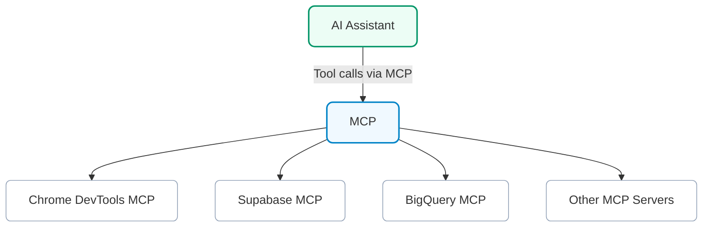
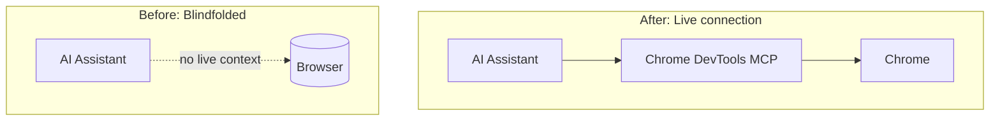
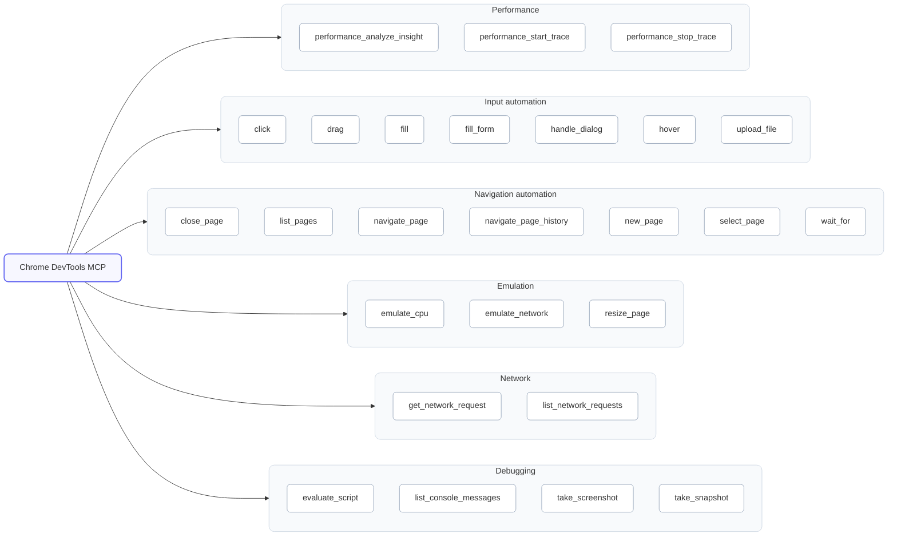

{:width="60%"}

Google has released a potentially significant tool for AI-driven web development and testing: an official [Chrome DevTools MCP](https://github.com/ChromeDevTools/chrome-devtools-mcp) integration. In plain terms, Chrome DevTools can now hook into AI coding assistants via the [Model Context Protocol (MCP)](https://modelcontextprotocol.io/). 

Chrome DevTools MCP is a new MCP server that exposes Chrome's debugging and performance surface to AI assistants. Beyond the usual "click, navigate, inspect" flows (which are very similar to [Playwright MCP](https://www.awesome-testing.com/2025/07/playwright-mcp)), the standout feature is performance work: an agent can start a DevTools trace, capture [Core Web Vitals](https://developers.google.com/search/docs/appearance/core-web-vitals) signals, and return concrete improvement suggestions—directly from a real Chrome session.

This post is a personal tour of what Chrome's MCP integration is, how it fits into the fast-evolving AI tooling space (as surveyed in my [AI Tooling for Developers Landscape](https://www.awesome-testing.com/2025/07/ai-tooling-for-developers-landscape) article), and—most importantly—the new workflows and use cases it unlocks for developers and testers.

## What is MCP and Why Should We Care?

Before we get into Chrome DevTools MCP specifically, it helps to know what MCP (Model Context Protocol) is in general. Think of MCP as a sort of universal adapter for AI tools—Gergely Orosz calls it the ["USB-C port of AI applications"](https://newsletter.pragmaticengineer.com/p/mcp). It's an open standard (originally introduced by Anthropic in late 2024) that lets large language models (LLMs) connect to external tools and data sources in a structured way. For a deeper dive into MCP theory and implementation, check out my article on [How Playwright MCP works](https://www.awesome-testing.com/2025/07/playwright-mcp). In other words, MCP defines how an AI can call out to a tool—whether it's a database, a browser, an OS command, you name it—and get results back.



MCP acts as a universal adapter between AI assistants and tool-specific servers.



This visual contrast shows how MCP removes the "blindfold" from AI assistants, giving them direct access to live browser state.

Under the hood, this builds on the idea of LLM function calling. Modern AI models like GPT-4, Claude, etc., can execute `tools` if those tools are defined in their environment. Traditionally, AI app developers had to hard-code a set of available tools (APIs for the AI) into their assistant. If you wanted your AI to do something new—say control a browser—you'd have to update the app with new functions. MCP flips that script. It allows AI assistants to dynamically discover and use tools from external MCP servers without the client app needing to know all the details upfront. The MCP server advertises what it can do (through a standardised handshake), and the AI can invoke those capabilities as needed. It's like plugging a new peripheral into your computer and having it instantly recognised—here the "peripheral" could be Chrome DevTools, and the "computer" is your AI agent.

## Chrome DevTools MCP Tool Overview

Chrome DevTools MCP is essentially [Chrome DevTools Protocol](https://chromedevtools.github.io/devtools-protocol/) exposed as an MCP server. The Chrome DevTools team built a bridge that connects an AI agent to Chrome's debugging interface (the same low-level protocol that tools like [Puppeteer](https://pptr.dev/) or [VS Code debugging](https://code.visualstudio.com/docs/debugtest/debugging) use). Once connected, the AI can drive the browser and retrieve data via [DevTools](https://developer.chrome.com/docs/devtools)—all through standardised MCP calls. [Google's announcement](https://developer.chrome.com/blog/chrome-devtools-mcp) frames it nicely:

>The Chrome DevTools MCP server brings the power of Chrome DevTools to AI coding assistants.

In practice, this means an AI can launch Chrome, open pages, click around, inspect elements, read console logs, record performance metrics—basically everything you and I do in DevTools, but automated.

Before diving into practical examples, let's explore the actual capabilities available in Chrome DevTools MCP. The integration provides 26 specific tools across 6 categories, giving AI assistants precise control over browser automation and debugging.

Here's the complete visual breakdown of available tools:



For the complete technical reference and detailed tool specifications, see the official Chrome DevTools MCP [tool reference](https://github.com/ChromeDevTools/chrome-devtools-mcp/blob/main/docs/tool-reference.md).

The real power comes from how these tools work together. An AI agent can chain multiple operations: navigate to a page, wait for elements to load, inspect the DOM, check for errors, analyse performance, and even simulate user interactions—all while providing contextual insights based on the actual browser state.

Configuration is straightforward. It can be enabled by adding the following to your application:

```json
{
  "mcpServers": {
    "chrome-devtools": {
      "command": "npx",
      "args": ["chrome-devtools-mcp@latest"]
    }
  }
}
```

Note that we are always using the latest version of the Chrome DevTools MCP server hence the number of tools may change over time. That's the actual benefit of MCP - we can use the latest server implementation without any updates on client side.

## Playwright MCP vs Chrome DevTools MCP

Both Chrome DevTools MCP and Playwright MCP cover the basics of browser automation – page navigation, clicking, typing, form handling, script execution, console log access, screenshots, etc. These core capabilities overlap significantly. However, each tool has a different focus and feature set, which makes understanding their differences important for developers, testers, and AI tool builders when choosing the right tool for a given task.

| Dimension | Chrome DevTools MCP | Playwright MCP |
|-----------|---------------------|----------------|
| **Performance tooling** | First-class performance profiling tools (e.g. `performance_start_trace` / `performance_analyze_insight`) for real-time Core Web Vitals trace analysis. | No built-in performance audit capability – can capture basic traces, but lacks on-the-fly Lighthouse-style analysis of metrics. |
| **Test generation** | No native test script generation feature (focuses on live analysis/debugging rather than producing code templates). | Provides automated test generation tools (e.g. `start_codegen_session`, `browser_generate_playwright_test`) to convert user actions or scenarios into Playwright test code. |
| **Network analysis** | Detailed network request inspection via DevTools: includes `list_network_requests` (to list all requests) and `get_network_request` (to fetch detailed info for a specific request). This allows examining headers, status, payload, etc. for any request. | Exposes network logs through `browser_network_requests` (e.g. exportable as HAR) to review overall traffic. Lacks a fine-grained per-request query tool (the agent must parse a HAR or use logs for details). |
| **Emulation capabilities** | Can simulate different device conditions: `emulate_cpu` and `emulate_network` throttle the browser's CPU speed or network to mimic slow devices/connections. Useful for performance testing under stress. | No dedicated CPU/network throttling commands (no equivalent to DevTools' emulation tools). Instead, Playwright's strength lies in multi-browser coverage rather than device condition simulation. |
| **Cross-browser support** | Chrome-only (built on the Chrome DevTools Protocol and Puppeteer, it controls a Chromium-based browser exclusively). | Multi-browser and multi-platform: can drive Chromium, WebKit (Safari), and Firefox engines by specifying the browser type, enabling cross-browser testing from one framework. |
| **DOM interaction model** | Selector-driven: actions typically require explicit CSS/XPath selectors for target elements (e.g. `fill({ selector: '#password', ... })`). A special `take_snapshot` tool can generate a DOM snapshot with unique element IDs for the agent to reference if needed. | Accessibility-driven: automatically captures a structured DOM snapshot via the accessibility tree, allowing the agent to refer to elements by human-friendly descriptions (e.g. `browser_type({ target: 'Password field', ... })`) without specifying selectors. This makes natural-language element references possible out-of-the-box. |
| **Debugging depth** | Deep debugging capabilities, tapping into Chrome's devtools: supports setting breakpoints and stepping through code execution (`set_breakpoint`, `step_over`), giving the AI full code-level debugging control. Also allows evaluating scripts and inspecting console logs in real time. | No low-level code debugging (no breakpoint/step features). Playwright automation is more black-box – debugging relies on logging, assertions, and capturing traces/videos after test runs rather than interacting with running code. Both systems support script evaluation and console log retrieval, but only DevTools MCP offers true interactive debugging of page scripts. |

### Shared Capabilities
Both MCP implementations handle fundamental UI automation tasks such as page loading, DOM queries, user input simulation, and state inspection in similar ways. An agent can navigate pages, click buttons, fill forms, execute JavaScript, and capture page state using either tool.

### Strengths Breakdown

**Chrome DevTools MCP strengths:** This tool's unique power is in deep diagnostics – it offers unparalleled depth of analysis within Chrome by exposing the full Chrome DevTools Protocol to the AI. Its integrated performance tracing, precise device emulation, and programmatic debugging features make it ideal for tasks like performance tuning and complex debugging in the Chrome ecosystem.

**Playwright MCP strengths:** Playwright MCP excels in breadth of coverage and automation workflow. Built on a resilient cross-browser framework, it provides an AI assistant with the robust toolkit of a QA engineer. Standout features include its accessibility-based DOM model, the ability to auto-generate test scripts, rich tracing capabilities, and native support for Chromium, Firefox, and WebKit – all of which make it well-suited for validating functionality across browsers and maintaining comprehensive test suites.

### Architectural Differences

Chrome DevTools MCP and Playwright MCP are rooted in different technologies, which leads to different philosophies. Chrome DevTools MCP is built by the Chrome team on top of the Chrome DevTools Protocol (CDP) and Puppeteer. In essence, it acts as an AI-driven extension of Chrome's developer tools – laser-focused on Chrome's capabilities for debugging and performance.

Playwright MCP, on the other hand, is built on Microsoft's Playwright framework, a multi-browser automation library. This means Playwright MCP is inherently polyglot: it can automate Chrome/Edge, Firefox, and Safari (WebKit) contexts, emphasising broad browser coverage and stable test automation over deep Chrome-specific introspection.

In practical terms, Chrome DevTools MCP prioritises depth in a single environment (Chrome). It gives an AI the same low-level control a developer would have in Chrome's DevTools – from inspecting network internals to profiling performance – making it a superior choice for diagnosing and investigating complex front-end issues within Chrome.

Playwright MCP prioritises breadth across different environments. Its design provides a consistent high-level API to drive any major browser, making it ideal for verifying user journeys and functionality in a cross-browser context.

### Element Interaction Models

One notable difference stemming from these architectures is how each approach identifies and interacts with page elements.

**Playwright MCP** was built around an accessibility tree model – it automatically captures a structured snapshot of the DOM, allowing the AI to refer to elements in a human-friendly way by role or label (e.g. "Submit button" or "Password field") rather than by strict selectors.

**Chrome DevTools MCP**, by contrast, expects the AI to specify targets via explicit CSS or XPath selectors (e.g. using a selector `#password` to find a field) unless the agent takes an extra step to request a DOM snapshot for reference. The DevTools MCP does provide a `take_snapshot` tool that returns a text-based DOM with unique element identifiers, which an agent can use to map and interact with elements by ID. However, this is an explicit action.

Out of the box, DevTools MCP is closer to how a developer works (direct selectors), while Playwright MCP makes the AI's view of the page more semantic and high-level from the start.

## Why Performance is the Unique Angle Here

While actions like navigation, DOM inspection, console checks and basic UI testing map closely to [Playwright MCP](https://www.awesome-testing.com/2025/07/playwright-mcp), DevTools MCP goes further on performance: it exposes trace recording and analysis primitives (`performance_start_trace`, `performance_stop_trace`, `performance_analyze_insight`) so an agent can collect evidence and interpret it in one loop.

## Lighthouse in Brief

[Lighthouse](https://www.awesome-testing.com/2018/03/five-minutes-performance-report-with) is Google's automated auditing tool that runs lab checks for Performance, Accessibility, SEO and more. It measures Core Web Vitals like LCP (loading), CLS (visual stability) and uses TBT as a lab proxy for responsiveness. Traditionally we ran Lighthouse in DevTools, CI, or via PageSpeed Insights to get a score and a list of opportunities.

### What Changes with DevTools MCP?

Instead of a one-off audit, you can orchestrate: record a DevTools trace, get insights, apply a code change, and re-trace—all inside the same agent session. This tight feedback loop moves performance work from "report then manually fix" to "investigate → change → re-measure" with the browser and agent in lock-step.

## Performance-First Debugging with DevTools MCP

Use these prompt patterns (they mirror the Chrome team's guidance) to shift from generic checks to trace-driven performance work:

**Automate a page-load trace**

```text
Start a performance trace for /path, reload, and analyse LCP, CLS and TBT.
List the top main-thread long tasks and render-blocking resources.
```

**Compare device/network profiles**

```text
Repeat the trace with mid-tier mobile CPU emulation and Slow 4G. 
Summarise deltas in LCP and TBT, and point to the culprit scripts.
```

**Actionable follow-ups**

```text
Suggest code-level changes to cut TBT by 30% (splits, defer, scheduler.postTask).
Then re-run the trace and show before/after numbers.
```

These are powered by DevTools MCP tools like `performance_start_trace`, `performance_stop_trace`, and `performance_analyze_insight`, plus standard navigation/DOM utilities when you need context.

## Example: Real Performance Analysis Session

Here's a detailed write-up of an actual session analyzing `/register` on localhost:8081 using DevTools MCP. This demonstrates the performance-first approach in action:

### The Prompt
```text
Using Dev Tools MCP analyse the performance of http://localhost:8081/register page. 
Are there any suggestions how to improve it?
```

### Performance Metrics Captured
- **LCP (Largest Contentful Paint): 271ms** - Under the 2.5s threshold ✅
- **CLS (Cumulative Layout Shift): 0.00** - Perfect, no layout shifts ✅  
- **TTFB (Time to First Byte): 8ms** - Very fast server response ✅

### Key Insight: Render Delay Bottleneck
The agent identified that **97.2% of LCP time (264ms)** was spent on element render delay, while only **2.8% (8ms)** was server response time. This immediately pointed to client-side rendering as the main bottleneck—not the backend.

### Detailed Findings
**Render-blocking resources:**
- CSS file `index-C3W9awP0.css` taking 77ms total duration
- 45ms spent on main thread processing
- Critical path latency: 93ms (HTML → JS + CSS)

**Console issues:**
- Missing `autocomplete` attribute on password field

### AI-Generated Recommendations
The agent provided specific, actionable fixes:

**High Impact:**
```html
<!-- Preload critical CSS -->
<link rel="preload" href="/assets/index-C3W9awP0.css" as="style" onload="this.onload=null;this.rel='stylesheet'">
<noscript><link rel="stylesheet" href="/assets/index-C3W9awP0.css"></noscript>
```

**Medium Impact:**
```html
<!-- Add resource hints -->
<link rel="preconnect" href="http://localhost:8081">
<link rel="dns-prefetch" href="http://localhost:8081">

<!-- Fix accessibility warning -->
<input type="password" autocomplete="current-password" />
```

**Strategic suggestions:**
- Code splitting to reduce initial bundle size
- Consider SSR for faster initial paint
- Implement performance monitoring

### Why This Matters
This isn't just a performance report—it's a **live debugging session** where the agent:
1. Recorded a real DevTools trace
2. Analyzed Core Web Vitals automatically  
3. Identified the root cause (render delay vs server response)
4. Provided specific code fixes
5. Could immediately re-test changes in the same session

This is the Lighthouse-style diagnosis, but **integrated into an iterative debugging loop**—trace → analyze → fix → re-trace—all without leaving the agent conversation.


## Conversational Debugging

DevTools MCP also enables conversational debugging workflows that are similar to [Playwright MCP](https://www.awesome-testing.com/2025/07/playwright-mcp)—you can ask questions about the live page state and get data-driven answers. The agent can inspect CSS rules, check console errors, analyze network requests, and correlate user actions with backend responses, all using Puppeteer under the hood.

For detailed debugging workflow examples, see my [Playwright MCP article](https://www.awesome-testing.com/2025/07/playwright-mcp). The key difference with DevTools MCP is the integrated performance analysis capabilities demonstrated above.

## Side-by-Side: Playwright MCP vs DevTools MCP

**Shared (broad parity)**: navigation, clicks, form-fill, JS eval, console/network inspection, screenshots—your [Playwright MCP](https://www.awesome-testing.com/2025/07/playwright-mcp) mental model transfers well.

**Technical difference**: DevTools MCP uses [Puppeteer](https://pptr.dev/) under the hood, while Playwright MCP uses Playwright's automation framework.

**DevTools MCP edge**: first-class performance tracing & insights from Chrome's Performance panel surface—the unique value for perf engineering.

If readers want the Playwright angle, check my two pieces on [theory](https://www.awesome-testing.com/2025/07/playwright-mcp) and [agentic execution tips](https://www.awesome-testing.com/2025/09/playwright-agentic-coding-tips).

## Conclusion

Chrome DevTools MCP turns performance optimisation into a conversational loop with Chrome: trace → analyse → change → re-trace. By letting AI agents "see" the running application through structured performance data, we bridge the gap between generic advice and actionable insights. The AI is no longer guessing—it has direct access to Core Web Vitals, network waterfalls, and long task analysis from a real Chrome session.

For technical readers eager to leverage this: explore the official [DevTools MCP tool reference](https://github.com/ChromeDevTools/chrome-devtools-mcp/blob/main/docs/tool-reference.md) and [Chrome's documentation](https://developer.chrome.com/blog/chrome-devtools-mcp) for setup. Experiment with prompts like:

```text
Use Chrome DevTools MCP to start a performance trace on http://localhost:8081/register,
reload, then analyse LCP/CLS/TBT and list top long tasks (>50ms). Propose code changes
and re-run the trace to validate improvements.
```

The responses you get will likely surprise you with their detail and accuracy. Over the coming months, expect this integration to mature and expand. It's part of a broader trend (my [AI tooling landscape](https://www.awesome-testing.com/2025/07/ai-tooling-for-developers-landscape) article describes the big picture) where AI agents become full collaborators in our development environments.

In my own workflow, I've started treating the AI as a performance companion that sits inside Chrome. It's not perfect—complex optimisations still sometimes require human insight—but it already saves time on routine analysis and catches issues I might miss. And each month it improves. I, for one, welcome this new kind of co-optimiser. After all, I prefer focusing on creative architecture rather than manually parsing every trace myself. With DevTools MCP, I finally have an AI that's well-equipped to help.

Give it a try: launch your site, enable DevTools MCP, and ask "Record a performance trace and tell me the top 3 bottlenecks." You might just find actionable insights from your new AI performance assistant.
