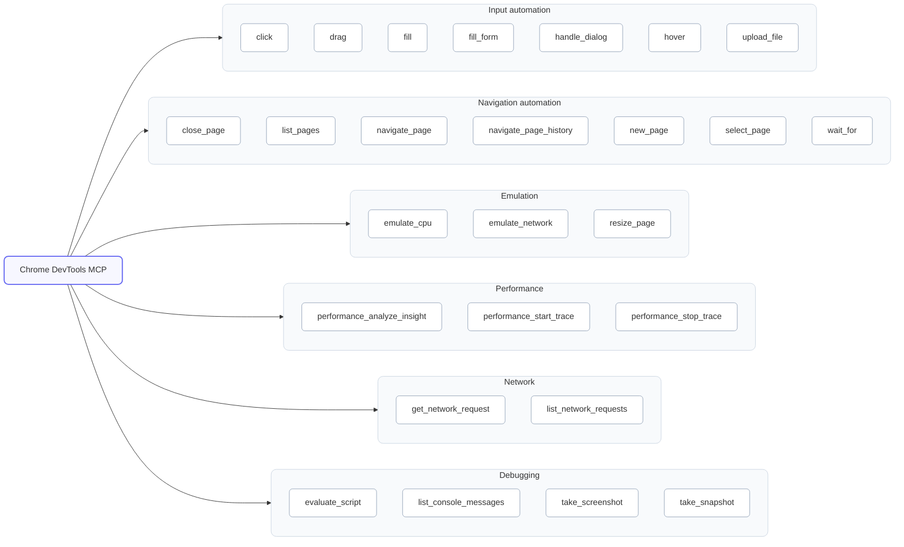

{:width="60%"}

Google dropped an important feature for AI-driven web development and testing: an official Chrome DevTools MCP integration. In plain terms, Chrome DevTools can now hook into AI coding assistants via the Model Context Protocol (MCP). As someone who's been writing about AI-driven development (as detailed in my [The rise of AI Driven Development](https://www.awesome-testing.com/2024/09/the-rise-of-ai-driven-development) article), I immediately jumped on this public preview. And let me tell you – it feels like my AI coding partner just had a blindfold taken off.

For the longest time, AI code assistants have been coding in the dark. They'd suggest code or tests without ever truly seeing the app run. They were "programming with a blindfold on," unable to verify what their code did in a real browser. Now, with Chrome DevTools MCP, that blindfold is gone. Our AI agents can spin up a real Chrome browser, inspect elements, check network calls, run performance audits – essentially do all the things we developers do in Chrome's DevTools, but on our behalf.

This post is a personal tour of what Chrome's MCP integration is, how it fits into the fast-evolving AI+browser tooling space (as surveyed in my [AI Tooling for Developers Landscape](https://www.awesome-testing.com/2025/07/ai-tooling-for-developers-landscape) article), and (most importantly) the new workflows and use cases it unlocks for developers and testers.

I'll cover how MCP works and why having it baked into Chrome DevTools is such a big deal. Then we'll dive into practical scenarios: AI-assisted debugging and exploration, intelligent DOM inspection, functional test generation and replay, performance tuning, and even asking an AI "Why is this element hidden?" and getting a meaningful answer. These aren't sci-fi promises – they're things you can do right now with the DevTools MCP preview. Let's explore how giving AI eyes on our webpages can transform our day-to-day development and testing.

## What is MCP and Why Should We Care?

Before we get into Chrome DevTools specifically, it helps to know what MCP (Model Context Protocol) is in general. Think of MCP as a sort of universal adapter for AI tools – Gergely Orosz calls it the ["USB-C port of AI applications"](https://newsletter.pragmaticengineer.com/p/mcp). It's an open standard (originally introduced by Anthropic in late 2024) that lets large language models (LLMs) connect to external tools and data sources in a structured way. For a deeper dive into MCP theory and implementation, check out my article on [How Playwright MCP works](https://www.awesome-testing.com/2025/07/playwright-mcp). In other words, MCP defines how an AI can call out to a tool – whether it's a database, a browser, an OS command, you name it – and get results back.

Under the hood, this builds on the idea of LLM function calling. Modern AI models like GPT-4, Claude, etc., can execute "tools" if those tools are defined in their environment. Traditionally, AI app developers had to hard-code a set of available tools (APIs for the AI) into their assistant. If you wanted your AI to do something new – say control a browser – you'd have to update the app with new functions. MCP flips that script. It allows AI assistants to dynamically discover and use tools from external MCP servers without the client app needing to know all the details upfront. The MCP server advertises what it can do (through a standardized handshake), and the AI can invoke those capabilities as needed. It's like plugging a new peripheral into your computer and having it instantly recognized – here the "peripheral" could be Chrome DevTools, and the "computer" is your AI agent.

Now, Chrome DevTools MCP is essentially Chrome's DevTools Protocol exposed as an MCP server. The Chrome DevTools team built a bridge that connects an AI agent to Chrome's debugging interface (the same low-level protocol that tools like Puppeteer or VS Code debugging use). Once connected, the AI can drive the browser and retrieve data via DevTools – all through standardized MCP calls. [Google's announcement](https://developer.chrome.com/blog/chrome-devtools-mcp) frames it nicely: "The Chrome DevTools MCP server brings the power of Chrome DevTools to AI coding assistants". In practice, this means an AI can launch Chrome, open pages, click around, inspect elements, read console logs, record performance metrics – basically everything you and I do in DevTools, but automated.

Why is this integration so significant? Because it directly tackles that "blindfold" problem. Our coding AI can finally see and interact with the live browser environment instead of guessing. An AI agent can now debug web pages directly in Chrome, benefitting from all the rich data DevTools provides (DOM trees, network timelines, JS console, performance traces). This dramatically improves the AI's accuracy in identifying and fixing issues, since it's basing decisions on real browser output rather than assumptions. In short, Chrome DevTools MCP gives AI assistants a pair of eyes and hands inside the browser – eyes to observe what's really happening in the app, and hands to poke around and interact with it.

## Chrome DevTools MCP Tool Overview

Before diving into practical examples, let's explore the actual capabilities available in Chrome DevTools MCP. The integration provides 26 specific tools across 6 categories, giving AI assistants precise control over browser automation and debugging.

Here's the complete visual breakdown of available tools:

For the complete technical reference and detailed tool specifications, see the [official Chrome DevTools MCP tool reference](https://github.com/ChromeDevTools/chrome-devtools-mcp/blob/main/docs/tool-reference.md).

The real power comes from how these tools work together. An AI agent can chain multiple operations: navigate to a page, wait for elements to load, inspect the DOM, check for errors, analyze performance, and even simulate user interactions—all while providing contextual insights based on the actual browser state.

## AI-Assisted Development & Debugging in the Browser

With the MCP server active, you can treat an AI assistant as a co-pilot in Chrome. You describe what you want (in natural language) and the AI decides which DevTools tools to use. In my experience, some powerful scenarios immediately emerged:

Verify code changes in real-time: After fixing a bug, I asked: "Can you verify in the browser that my change works?" The AI opened Chrome, navigated to the affected page, and interacted with it. It even ran my unit test flow manually. By calling things like click and evaluate_script, it checked that the UI now behaves as expected. In seconds I had confirmation that the bug was resolved. This is like having a tireless colleague instantly run a quick end-to-end check every time you fix something.

Diagnose errors with context: Suppose images on localhost:8080 aren't loading. Instead of guesswork, I asked the AI: "Some images on localhost:8080 are not loading. What's happening?" The agent immediately used list_network_requests to find the image URL and saw a 404 status. It then called list_console_messages to check the Console and noted a CORS warning. The AI's answer was precise: it reported the broken URL and mentioned the CORS policy error it saw. In the past an AI might have just given generic advice; now it literally observed the network and console to give a factual diagnosis.

Smart DOM inspection (CSS and layout bugs): I tried: "Why is the submit button not visible on the page?" Under the hood, the AI used evaluate_script to query the DOM and getComputedStyle on that element. It found that the button had display: none due to a media query for small screens. It also checked parent elements in case of visibility: hidden or zero opacity. The answer it gave was: "The <button> is hidden by CSS: a rule in styles.css at line 42 sets display:none on .submit-btn for viewport width under 600px." This kind of answer came from actually pulling CSS info via DevTools, not just an educated guess.

Reproduce and debug user flows: This was a head-turner. I asked the AI: "Walk through the signup flow and let me know why it fails at the end." The agent opened Chrome, used navigate_page to load the signup page, then fill or fill_form to enter test data. It clicked the submit button, then watched for changes. By calling list_console_messages afterwards, it spotted a JavaScript error in the signup script. The response was concrete: "The signup fails because a TypeError occurs: Cannot read property 'email' of undefined in signup.js. This is preventing form submission." It even referenced the source file name. Previously an AI only saw my code statically; now it followed the interactive flow and caught the exception where it occurred. It's the difference between a textbook answer and a lab experiment.

In each case, the AI simply used DevTools tools to gather evidence. For example, to answer "why is X hidden?", it might run an evaluate_script like:

let elem = document.querySelector('#submit');
window.getComputedStyle(elem);

and also see if any CSS style sheets contain a related rule. Or to diagnose an image load error, it fetches the network log entry for that URL.

Under the hood, these interactions might look like a sequence of MCP calls (in JSON form). For instance:

{"tool":"DevTools","action":"navigate_page","params":{"url":"http://localhost:3000"}}
{"tool":"DevTools","action":"list_network_requests","params":{}}
{"tool":"DevTools","action":"get_network_request","params":{"id":"request123"}}
{"tool":"DevTools","action":"list_console_messages","params":{}}

Each response feeds into the AI's reasoning. Importantly, the AI decides the flow of calls: it plans which tools to invoke based on the problem.

This new capability dramatically improves debugging speed. Instead of manually opening the Console and Network panels, filtering logs, etc., I can now simply ask. The AI will cross-correlate DOM state, network results, and console output to give an answer. The quality of answers is much higher because it's grounded in live data. Google's docs predict that this "should improve accuracy when identifying and fixing issues" – and in practice I agree.

The high-value cases I see day-to-day are those repetitive troubleshooting steps: verifying a fix, checking for new errors, pinpointing layout quirks. All of these are now automated. The AI can even proactively alert you: "I noticed a 500 error during signup" or "Element X has hidden style on mobile." It's like having an AI monitor your DevTools as you code.

## AI-Enhanced Functional Testing Workflows

Chrome DevTools MCP also supercharges UI testing. By giving an AI agent full control of the browser, we can generate, execute, and maintain automated tests in a much more fluid way. Here are some scenarios I explored:

Generate and execute tests on the fly: I prompted my AI: "Test the login process and confirm the dashboard shows the logged-in username." The agent used navigate_page, fill (for username/password fields), and click to submit. It then waited (wait_for) a dashboard element to appear. Using take_snapshot, it captured the DOM and checked that the username text is present. Instantly it reported the result. Then, as I requested, it translated this run into a Playwright test script in code form. (For example, after performing the steps via MCP, it output Playwright commands like page.fill('#user', 'test'), page.click('#login'), and an expect() on the dashboard text.) Essentially, the AI created and ran a working UI test with zero boilerplate from me. This shows how you can describe a scenario in plain language and get an automated test & report back.

AI-driven test execution and maintenance: Once tests exist, the same agent can run them repeatedly and adapt them if they break. In one experiment, I changed an element's ID in my app so a selector would normally break. The AI's next run failed to find #submitButton, but it didn't give up: it switched to using a different selector (button[type=submit]) by reasoning about the button's text. It then updated the test steps accordingly. In essence, the AI "self-healed" the test. In practice, this could mean far less flaky tests. The AI can also enrich tests by checking more than just the explicit assertions: after each step it might call list_console_messages to see if any hidden errors occurred, or take screenshots to compare, effectively turning each test step into a mini exploratory audit.

Exploratory testing on demand: One of the coolest uses is simply asking the AI to poke around and report issues. I tried: "Explore the app and let me know if anything looks broken." The agent systematically opened pages, clicked through menus, filled a few forms with random data, and watched for errors or anomalies. It took screenshots at key moments. The result was a brief report: "On the product page, there's a missing image (404), and on the filter list page, a console error appears ('Undefined is not a function'). Also noticed that the load time on the checkout page is unusually high. See attached screenshot for the filter page." This felt like a diligent QA tester running wild on the site. In demos and early tests, agents have indeed caught regressions (broken links, JS errors, visual glitches) that manual checks missed. And crucially, it did this without me writing any script up front. It's powerful for sanity-checking a new deployment: just point the AI at your staging URL and ask it to find issues.

Contextual assertions and rich reports: Traditional tests only check what you program them to check. An AI-powered test can have a broader view. For example, after logging in, a normal test might only assert the welcome message. The AI test, however, looked around and noted that the user avatar image failed to load (it saw the broken image URL). Or after submitting a form, even if success happened, it pointed out a console warning about a deprecated API. This is because after each action the AI can inspect everything: DOM state, CSS layout, console, network. It can say "overall, the primary function worked, but I noticed this minor issue." That's incredibly valuable for regression testing where small defects creep in.

Behind the scenes, this works because the MCP tools cover all the actions a tester might do. The agent can simulate real user input (clicks, typing, file uploads), handle dialogs, and manipulate navigation. It can list pages and switch contexts in case of multi-tab flows. For state inspection, it can query CSS computed styles (evaluate_script('getComputedStyle(...)')) to understand UI, or use the Clipboard, etc. And with take_screenshot and take_snapshot, it can capture the entire app state for comparison or evidence.

The net effect is that test automation becomes more adaptive and accessible. Teams with minimal automation can have an AI spin up a baseline test suite from high-level descriptions. Teams with existing suites can offload maintenance: the agent notices when a locator breaks or a step fails. In CI/CD, imagine the agent automatically running after each build and posting an annotated report of any anomalies it finds. The coverage and reliability of UI tests could significantly improve.

So far, the biggest wins are in regression testing and quick scenario coverage. Having an AI agent explore changes (even overnight) can catch subtle UI regressions. And generating new tests from simple prompts (e.g. "test the shopping cart flow") saves tons of manual coding. This is not hype – I've tried it, and it works surprisingly well. Of course, for production use you'd validate the generated code and integrate it, but the AI does the heavy lifting of interaction and initial script drafting. The Playwright MCP article covers similar ideas: treat the AI as a perpetual, intelligent tester that never tires.

## Performance Analysis and Tuning

Web performance is another area where DevTools MCP shines. Performance profiling traditionally involves capturing a trace or loading a page with throttling, then manually inspecting the waterfall, CPU profile, etc. An AI agent can automate this process on demand and even interpret the results.

Using the performance_start_trace and performance_stop_trace tools, you can tell the AI: "Record a performance profile while loading the homepage." The agent will start the trace, navigate to your page, wait for load, then end the trace. It now has a Chrome Trace JSON blob (including timings for scripting, rendering, network, etc.). The agent can either analyze this JSON itself (if it's been trained on trace formats) or use the convenience tool performance_analyze_insight which returns a summarized report (like a mini-Lighthouse). In one test, I had a demo page known to be slow: the AI reported "LCP is 4.2s, which is high. The trace shows a 2.1s long task on the main thread caused by a heavy script execution. Also, five large images (each >500KB) were loaded without compression, contributing to slow load." It even suggested lazy-loading images and breaking up the script. In effect, the AI gave me a performance audit, exactly as a seasoned perf engineer might, but automatically.

Beyond single loads, the agent can simulate conditions. For example: "How does the homepage perform on a mid-tier mobile device?" The AI could respond by re-running the trace with emulate_cpu (slowing the CPU) and emulate_network (e.g. slow 3G). It would then compare metrics: maybe LCP jumps to 8s, and it finds a new slow long task that was hidden on desktop. This is like having an automated performance lab in your CI.

Because the agent controls the browser, it knows exactly when events happen. It can correlate user actions with performance costs. For instance, after clicking a button, it might see "there was a 1.2s lag before any UI response – checking the network log shows a fetch took 1.1s, explaining the delay." Such end-to-end reasoning (action → network → rendering) helps pinpoint where optimizations are needed.

In practice, these insights come with one prompt: "The page is slow, why?" or "Make this page load faster." The assistant then uses DevTools performance APIs to gather data and surface bottlenecks. This lowers the barrier to performance tuning – even devs unfamiliar with interpreting traces can rely on the AI's analysis. It's like having an on-call performance expert that never sleeps.

## Conversational Debugging: Talking to DevTools

Perhaps the most futuristic feeling aspect is conversational debugging. Instead of clicking around in DevTools yourself, you can ask the AI questions about the live page. Here are a few examples:

"Why is the <nav> element not visible on mobile?" The AI might respond: "I inspected the <nav> and found a CSS media query in main.css (line 120) that sets display:none for .site-nav at widths < 768px. That's why it's hidden on your phone viewport." It got this by calling DevTools tools to retrieve the matched CSS rules and computed style of that element. You could follow up: "What rule is making it hidden?" and it would drill down with more DevTools queries.

"I clicked the 'Add to Cart' button, but nothing happens. Do you see an error?" The AI would simulate that click, then check the Console and network. It might reply: "Yes, there is an uncaught TypeError in cart.js (see console). The error is price.toFixed is not a function. This likely means the item price is undefined. The network request for adding the item returned 500." This answer might cite the exact console message and even line of code (if source maps are available). It correlates the UI action to backend response and JS error seamlessly.

"Is any element overlapping or off-screen?" The AI can run evaluate_script to check element positions or even take a full-page screenshot to analyze layout. It could answer: "The footer overlaps the content on narrow screens – I see position: fixed on the footer pushing it up." This kind of visual/CSS question can be handled by querying DOM geometry or even by visually comparing screenshots, if the agent has vision (some AI models can reason about images).

The common thread is: you treat DevTools as another expert in the room. You ask a question about the application state, and the AI "asks" DevTools for data, then synthesizes the answer in plain English. This dialogue-driven approach can accelerate root-cause analysis. In effect, DevTools becomes a knowledge base that the AI can query using natural language, via the MCP bridge.

For developers, this means you can discover issues by conversation. Instead of sifting through logs yourself, you say "debug this" and get a concise explanation. If the AI's answer mentions a code location or a specific file (for example, "styles.css:42 hides the button"), you can click that suggestion or navigate there. The AI can even suggest a fix: "Remove that rule or adjust the media query". I've found this really streamlines the cognitive load of debugging – the mental context of the live page is managed by the AI.

Technically, all of this conversation happens because the AI knows what tools to call. When you ask a question, the underlying system (via MCP) proposes a plan of calls (e.g., evaluate_script then list_console_messages) to gather facts, and then returns an answer. It's a new user interface to DevTools: instead of panels, we have chat.

## Latest Updates and Future Directions

As of late 2025, Chrome DevTools MCP is still in an active development phase (public preview in Chrome 116+). The DevTools team has already added several refinements since the initial announcement. For example, the list of available tools is growing – there are plans to add deeper accessibility and security auditing tools to the MCP schema. (Tracking the [official DevTools blog] and the GitHub repo will show any new additions.) The integration is also expanding platform support: initially focused on desktop Chrome, there are moves to bring MCP to Chrome on Windows and Mac (and maybe even Chromium-based browsers) by default. Google has talked about "maturity" of this feature in upcoming DevTools releases.

Other AI and browser teams are taking note too. Playwright's MCP support (covered [earlier]) is closely aligned, and I wouldn't be surprised if tools like VS Code's webview debugging or Edge DevTools consider similar AI hooks. The idea of AI with "browser vision" is powerful, so it may inspire more standards or plugins.

For now, the main advice is: try it out if you're a web developer or tester. Enable the MCP server in your Chrome, connect your favorite AI agent, and start asking questions or writing tests. It's early days, but the productivity gains are real. In some demos I saw, teams have already integrated AI-driven DevTools checks into their CI pipeline (the AI runs on each merge and reports any page errors). I personally feel like this is one of those developments that will quietly become part of our workflow – analogous to how we take debug consoles for granted now.

## Conclusion

Chrome DevTools MCP marks a significant step toward truly AI-augmented development. By letting AI tools "see" the running application, we bridge the gap between code suggestions and real-world behavior. The AI is no longer blind — it has a microscope (the Elements panel) and a lab (the Console/Network/Performance panels). The end result is smarter debugging, faster test automation, and a smoother feedback loop for changes.

For technical readers eager to leverage this: explore the official [DevTools MCP tool reference] and Chrome's documentation for setup. Experiment with prompts like "Open example.com, log in, and tell me if there are any errors." The responses you get will likely surprise you with their detail and accuracy. Over the coming months, expect this integration to mature and expand. It's part of a broader trend (my [AI tooling landscape] article describes the big picture) where AI agents become full collaborators in our development environments.

In my own workflow, I've started treating the AI as a debugging companion that sits inside Chrome. It's not perfect – complex logic still sometimes trips it up – but it already saves time on routine checks. And each month it improves. I, for one, welcome this new kind of co-debugger. After all, I prefer focusing on creative architecture rather than hunting down every trivial bug myself. With DevTools MCP, I finally have an AI that's well-equipped to help.

Give it a try: launch your site, enable DevTools MCP, and ask "Are there any issues on this page?" You might just find a helpful insight from your new AI assistant. Happy debugging!
