There’s rarely been a better time to write about software engineering. The AI world moves at breakneck speed — every week brings a new model, framework, or "agentic" idea promising to reshape how we build software. For bloggers like me, it's a goldmine of fresh topics. For developers, it's a race to stay sane amid the noise.

AI coding tools have quickly become the centrepiece of nearly every IT roadmap. From startups to the largest enterprises, everyone's chasing the same question: **how do we move faster without sacrificing quality?** Agentic coding — where AI plans, writes, and iterates on code — seems to offer the edge. But as anyone who's tested these loops knows, the story isn't that simple. Agents can help you sprint; they can also lead you straight into a ditch.

Amid the hype, an old discipline is quietly making a comeback: Test-Driven Development. Once dismissed as slow or old-fashioned, TDD is finding new relevance in the AI era. It turns out that when code is written by agents instead of humans, tests become the guide — the stable reference point that gives the agent a sense of direction.


<blockquote class="twitter-tweet">
  <p lang="en" dir="ltr">Tweet content from Gergely Orosz discussing TDD and AI development practices</p>
  &mdash; Gergely Orosz (@GergelyOrosz)
  <a href="https://twitter.com/GergelyOrosz/status/1973144868638617772">September 30, 2025</a>
</blockquote>
<script async src="https://platform.twitter.com/widgets.js" charset="utf-8"></script>

In this post, I'll give a short refresher on classic TDD, then show how its principles translate into Test-Driven AI Development (TDAID) — a practical way to harness AI tools without losing control. I'll also explain why TDD is suddenly fashionable again, and how it can help you build better software with AI.

## TDD

Test-Driven Development (TDD) is a disciplined way of writing software that flips the usual order of operations. Instead of coding first and testing later, you start with a failing test that expresses the behaviour you want. The process runs through a tight feedback loop known as Red → Green → Refactor:


- **Red:** Write a test for the next piece of behaviour and watch it fail. This confirms the test is valid and the feature doesn't yet exist.

- **Green:** Write the simplest code that makes the test pass. Don't optimise, don't abstract — just make it work.

- **Refactor:** Clean up the implementation and the tests while keeping everything green. Simplify names, remove duplication, improve readability, and prepare for the next increment. All changes should be accompanied by running tests to ensure the code still works.

Each loop should be as small as possible. That cadence provides a continuous measure of progress and a growing safety net of executable documentation. Over time, your test suite becomes the living specification of the system — a set of examples proving not only that the code works, but why it works.

## TDAID

Test-Driven AI Development extends the familiar TDD loop with an additional phase at the start — planning — and an explicit validation step at the end. Together, they form a five-phase workflow: Plan → Red → Green → Refactor → Validate.


### Plan

That's where AI-assisted work truly begins. Before generating any code, we ask the model to produce a structured implementation plan — a roadmap defining what we're about to build, the phased code changes, the tests to be written, and the expected outcomes.

I wrote earlier about this step in [AI Vibe Coding — Notes from the Basement](https://www.awesome-testing.com/2025/04/ai-vibe-coding-notes-from-the-basement#step-3-ask-a-thinking-model-for-a-detailed-implementation-plan). Back then, I didn't explicitly connect it to TDD. Now, I ask the thinking model (usually `gemini-2.5-pro` or `gpt-5` with extended thinking, previously `o1` or `o3`) to generate a phased plan in TDD format — with clear Red, Green, and Refactor checkpoints baked in.

More nuanced approaches to planning have since emerged, such as [Spec-Driven Development (SDD)](https://github.blog/ai-and-ml/generative-ai/spec-driven-development-with-ai-get-started-with-a-new-open-source-toolkit/) and dedicated planning modes in [Cursor](https://cursor.com/blog/plan-mode) or [Claude Code](https://claudelog.com/mechanics/plan-mode/). I still use my old approach as it works well for me

This step is de facto one of the few established best practices in AI-assisted software development. I recommend doing it whether or not you follow TDD.

### Red → Green → Refactor

Once the plan is in place, the loop works much like classic TDD — just at AI speed.

- **Red:** Generate or write a test that expresses the desired behaviour.

- **Green:** Let the agent implement the smallest possible change to make it pass.

- **Refactor:** Clean up and improve the code.

Most of the time, unless we use [asynchronous background agents](https://www.awesome-testing.com/2025/07/ai-tooling-for-developers-landscape) or CLI tools in [headless mode](https://docs.claude.com/en/docs/claude-code/headless), we pause after each phase to manually verify correctness and intent alignment.

Watch out for LLMs (especially Claude Sonnet) trying to "cheat" the tests by:

- removing them altogether
- leaving assertions empty
- ignoring them
- generating code that passes tests instead of fixing the code to make them pass

To stay in control, I make a local commit after each phase:

```commandline
git add .
git commit -m "AI Phase 1 done"
```

I also like to let the agent mark completed phases in the original plan with a ✅ emoji — a small thing, but it keeps sessions resumable and transparent.

### Validate

After the agentic session, we end with a deliberate human-in-the-loop verification. Tests may be green, but we still need to confirm that the implementation matches the plan, handles edge cases, and reads well enough for future maintenance.

This validation is currently the bottleneck in AI-assisted development. Models can produce working code rapidly, but human review remains the only reliable measure of quality and trust.

The [Theory of Constraints](https://www.amazon.pl/
Goal-Anniversary-Process-Ongoing-Improvement/dp/0884271951) suggests that overcoming this bottleneck could deliver high ROI — and I expect significant innovation here soon: contextual AI code reviews, MCP-based exploratory tests, and AI-driven API testing frameworks are all on the horizon. 

## Why now?

AI-assisted coding has changed both who writes the code and how it's written. The speed and autonomy of modern LLMs force us to rethink what "done" means. TDD fits this landscape perfectly because it anchors fast, automated iteration in verifiable outcomes.

Three forces drive its renewed relevance:

- Agentic loops need reliable feedback.
- Working in phases acts as a guardrail against chaos.
- Non-deterministic behaviour demands robust regression control.

### Agentic loops need reliable feedback

Reminder from [Understanding Playwright Agents](https://www.awesome-testing.com/2025/10/playwright-agents). Agents are processes running tools in a loop (image credit: [Matt Pocock’s](https://x.com/mattpocockuk)):


Tests give us a reliable exit criteria. We are not relying on AI agent's whims, but we force it to iterate until the previously failed tests pass. As Simon Willison [describes it](https://simonwillison.net/2025/Sep/30/designing-agentic-loops/):

<blockquote class="twitter-tweet">
  <p lang="en" dir="ltr">Tweet content from Simon Willison discussing the importance of tests in agentic development</p>
  &mdash; Simon Willison (@simonw)
  <a href="https://twitter.com/simonw/status/1973046547144380697">September 30, 2025</a>
</blockquote>
<script async src="https://platform.twitter.com/widgets.js" charset="utf-8"></script>

Without clear exit conditions, agents can spin indefinitely or stop too early. Tests solve this elegantly: they define objective success criteria. The agent doesn't decide when the work is done; the tests do.

A failing test marks the loop's starting point. A passing one marks its end. That single rule turns an open-ended process into a closed, measurable one — transforming brute-force exploration into a disciplined feedback system.

It is also a very relevant piece of advice for Test Engineers. While using 
AI to write higher level tests we can encourage AI to:

```
Run the tests once they're complete.
Make sure they pass.
Iterate if needed with the fixes.
```

### Working in phases as a guardrail against chaos

There has been a great deal of trial and error with AI-assisted development. Because agents can generate large quantities of code very quickly, the potential cost of missteps is higher: unchecked increments may produce code that looks correct (tests passing, mocks abundant), but actually skirts real defects or embeds brittle logic. Without disciplined increments you risk losing control of the codebase.

From experience I've found it's faster and safer to guide the agent into discrete, small steps. In fact, when I spot an agent churning too much code in one burst, I often revert the whole change and restart (as I've said above up-to-date plan allows me to do that) — this time explicitly requiring the agent to produce smaller increments.

This incremental work ties directly into recognised software-engineering benefits. For example:

- Breaking a large feature into small, manageable parts allows regular feedback and adjustment.
- Delegating simple work to junior developers.
- When changes are small and isolated, it's easier to track down bugs and perform meaningful review.
- By contrast, large undifferentiated changes increase cognitive load for reviewers — making errors more likely and review outcomes weaker.

Applied to AI-assisted workflows, phase discipline looks like this:

- The agent works in a few tests → a few code changes → verify tests pass → refactor loops rather than "write full module → hope for the best".

```mermaid
flowchart LR
    P[🧭 Planning Phase<br/>Define goals, behaviours, and tests] --> L1[TDD Loop 1]
    L1 --> L2[TDD Loop 2]
    L2 --> L3[TDD Loop 3]
    L3 --> D[✅ Work Done<br/>Feature delivered & validated]

    %% Optional styling
    classDef plan fill:#f5f5f5,stroke:#666,stroke-width:1.5px;
    classDef loop fill:#e6f0ff,stroke:#3366ff,stroke-width:1.5px;
    classDef done fill:#e8f5e9,stroke:#2e7d32,stroke-width:1.5px;

    class P plan
    class L1,L2,L3 loop
    class D done
```



- Each increment is small enough for a human reviewer to reasonably assess.

- If the agent overshoots and produces too much at once, it becomes faster to revert and restart the loop with constrained scope than to try to salvage a sprawling change.

In short: working in phases greatly improves the chances of success of the agentic workflow.

### Non-deterministic behaviour and regression control

When we bring AI agents into software development, one major shift is that we're no longer always working with deterministic systems. Unlike conventional code where the same input yields the same output, AI-driven systems involve [non-perfect models](https://livebench.ai/#/) whose behaviour can drift, context can [become poisoned](https://www.oreilly.com/radar/working-with-contexts), and [hallucinations](https://www.frontiersin.org/journals/artificial-intelligence/articles/10.3389/frai.2025.1622292) can surface — especially when agents push against the limits of their context window or chain of tool calls.

We should always assume that the agent is not perfect and we shouldn't rely on it to be. The question remains whether it would change anytime soon. Andrej Karpathy is [rather pessimistic](https://www.youtube.com/watch?v=lXUZvyajciY) about it.

From my experience and others in the field, we should therefore insist on:

- High coverage of fast, reliable unit tests — these act as the first line of defence.

- Ensuring quality of the tests themselves — it's not enough to generate tests, you may need to author (or review deeply) the tests so they fail for the right reasons rather than just "passing because the code was superficially compliant".

- Fast execution of tests — they must run quickly so that the feedback loop remains tight for agents and humans alike.

- Controlled regression gates — treat the test suite as the contract that the agent must satisfy, and use it to detect drift or unintended changes.

There huge mission ahead of test engineers to ensure the above principles are followed by the team.

## Conclusion

We've entered a strange but exciting phase in software engineering. AI agents can plan, code, and even test — yet the need for strong engineering discipline has never been greater. The illusion of speed tempts teams to skip guardrails, but the only thing separating high-velocity progress from chaos is the quality of the tests.

Many engineers haven't yet realised how much the game has changed. In the pre-AI world, testing was often seen as a support function — something that followed coding. Today, it's the bottleneck that defines throughput. Delivery speed is limited not by how fast the model writes code, but by how confidently we can verify it.

That's why the role of test engineers is more critical than ever. Teams succeed when:

- tests are stable, fast, and meaningful;

- quality gates are enforced early;

- test infrastructure scales with AI-generated output;

- and engineering principles are consistently applied.

We'll need to optimise suites, refine processes, and uphold strong standards for human-in-the-loop validation. But it's also a rare opportunity: test engineers now sit at the centre of AI-powered delivery pipelines — ensuring the system learns the right lessons from its feedback loops.

Adopting TDD, or its evolution as Test-Driven AI Development, is one of the most impactful moves we can make. It gives structure to agentic chaos, protects against regression, and re-establishes software quality as the guiding force behind automation.

It's in our best interest to understand AI deeply enough to make it our ally, not our adversary.
