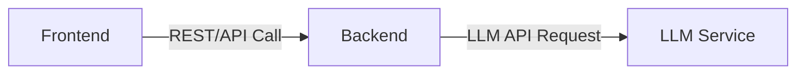
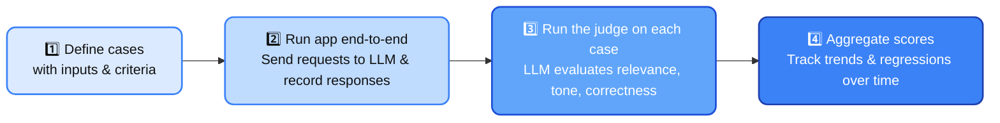

Large Language Models (and AI in general) broke the rules traditional QA was built on. Even at `temperature=0`, you [can’t expect](https://medium.com/google-cloud/is-a-zero-temperature-deterministic-c4a7faef4d20) the same output twice. Under the hood, GPUs run thousands of floating-point operations in parallel; tiny rounding differences or dynamic batching make every generation a new roll of the dice. The result isn’t a single binary answer (PASS/FAIL) — it’s a distribution of possible sentences that shifts with time, data, and infrastructure.

That destroys the old idea of "expected output". Two answers can mean the same thing but differ in phrasing, tone, or structure. Human reviewers disagree; automated checks fail. Testing stops being a binary act of "is it correct?" and becomes an investigation into how consistently and how usefully the model behaves. You have to judge sharpness, helpfulness, and how well it aligns with your organisation’s standards and voice.

### From Pass/Fail to Scaled Evaluation

Traditional QA frameworks, including ISTQB, train us to think in binaries — passed or failed. That logic collapses when applied to systems that speak in probabilities. A language model doesn't "pass" a test; it produces an output that lands somewhere on a spectrum of quality. Measuring that spectrum means adopting a new mindset: from assertions to evaluations, from single checks to trend analysis.

Instead of asking, "Did it match the expected value?", we ask, "How close did it get?" and "Is the average getting better?" Each test case becomes a data point on a 0–1 scale — perhaps 0.4 for relevance, 0.6 for tone, 0.8 for factuality. The goal isn’t to eliminate variation but to understand and steer it.

A mature workflow doesn't celebrate a single "green" test; it watches for statistical improvement across releases. You run the same eval suite weekly, plot the mean and variance, and learn when the model drifts. This is how quality assurance evolves from a gatekeeper to a continuous sensing system for AI behaviour.

### System Under Test

In this post, I want to show how to test an LLM-based application effectively — not as a lab curiosity, but as a living system you can run locally. To make it realistic, I’ll use my own [awesome-localstack](https://www.awesome-testing.com/2025/03/comprehensive-local-testing-stack) setup which runs [Ollama](https://ollama.com/) container with [Qwen3-0.6B](https://huggingface.co/Qwen/Qwen3-0.6B) model.

{:width="80%"}

We’ll work with a simplified architecture because clarity matters more than scale. The stack includes a React frontend, a Spring Boot backend, and an LLM service running inside Docker. Together, they form a minimal yet complete system for end-to-end experimentation.



This diagram represents the basic interaction path — user requests move through the frontend to the backend, which calls the LLM container via an API. It’s a lean model that still lets us test the full lifecycle: data exchange, orchestration, and AI output evaluation.

Sources:
- [Backend](https://github.com/slawekradzyminski/test-secure-backend)
- [Frontend](https://github.com/slawekradzyminski/vite-react-frontend)
- [Dockerised localstack](https://github.com/slawekradzyminski/awesome-localstack)

### What's to come?

We’ll focus on three key pillars of testing this system:

- **Core Deterministic System** – deterministic parts of the app (UI, APIs, data flow) with mocked LLM parts.

- **End to End evaluation** – testing the full system end to end.

- **Testing in Production** – testing the system in production.

{:width="80%"}

At the end, I’ll also touch on additional quality checks you may wish (or have to) perform.

Let's get started!

## Core Deterministic System

Not every component in an AI system is unpredictable. In fact, most of it isn’t. When you look closely at the architecture above, you can easily separate the deterministic from the non-deterministic.

The frontend talks only to the backend; the backend calls the LLM API. Everything up to that point follows fixed logic. The uncertainty starts only when the request leaves the backend and hits the model.


That distinction gives us a simple, powerful testing strategy: **mock the non-deterministic part** and test the rest as you always have.

If we replace the LLM call with a deterministic mock — for example, using Wiremock or a lightweight stub server — our system becomes entirely predictable. We can assert on REST responses, API contracts, and UI flows with the classic binary pass/fail rules. Unit tests, contract tests, and integration tests all remain valid.

This step ensures that any failures you see are caused by real defects in your code, not by the model’s randomness. Once the core behaves deterministically, you can safely layer LLM evaluations on top.

Here is the example code from my [backend app](https://github.com/slawekradzyminski/test-secure-backend/blob/master/src/test/java/com/awesome/testing/endpoints/ollama/OllamaMock.java):

```java
package com.awesome.testing.endpoints.ollama;

import com.awesome.testing.dto.ollama.ModelNotFoundDto;
import com.awesome.testing.dto.ollama.StreamedRequestDto;
import com.awesome.testing.dto.user.Role;
import com.awesome.testing.dto.user.UserRegisterDto;
import org.junit.jupiter.api.Test;
import org.springframework.http.*;

import java.util.List;
import java.util.Map;

import static com.awesome.testing.factory.UserFactory.getRandomUserWithRoles;
import static com.awesome.testing.factory.ollama.OllamaRequestFactory.*;
import static com.awesome.testing.util.TypeReferenceUtil.mapTypeReference;
import static com.github.tomakehurst.wiremock.client.WireMock.*;
import static org.assertj.core.api.Assertions.assertThat;

@SuppressWarnings("ConstantConditions")
class OllamaGenerateControllerTest extends AbstractOllamaTest {
    private static final String OLLAMA_GENERATE_ENDPOINT = "/api/ollama/generate";

    @Test
    void shouldStreamResponseWithValidToken() {
        // given
        UserRegisterDto user = getRandomUserWithRoles(List.of(Role.ROLE_CLIENT));
        String authToken = getToken(user);
        StreamedRequestDto request = validStreamedRequest();
        OllamaMock.stubSuccessfulGeneration();

        // when
        ResponseEntity<String> response = executePostForEventStream(
                request,
                getHeadersWith(authToken),
                String.class,
                OLLAMA_GENERATE_ENDPOINT
        );

        // then
        assertThat(response.getStatusCode()).isEqualTo(HttpStatus.OK);
        assertThat(response.getHeaders().getContentType().toString())
                .isEqualTo("text/event-stream;charset=UTF-8");
        assertThat(response.getBody()).containsAnyOf("Hello", "world", "my friend");

        verify(postRequestedFor(urlEqualTo("/api/generate"))
                .withRequestBody(matchingJsonPath("$.model", equalTo("qwen3:0.6b")))
                .withRequestBody(matchingJsonPath("$.prompt", equalTo("test prompt")))
                .withRequestBody(matchingJsonPath("$.stream", equalTo("true"))));
    }

    @Test
    void shouldGet400WhenRequestIsInvalid() {
        // given
        UserRegisterDto user = getRandomUserWithRoles(List.of(Role.ROLE_CLIENT));
        String authToken = getToken(user);
        StreamedRequestDto request = invalidStreamedRequest();

        // when
        ResponseEntity<Map<String, String>> response = executePostForEventStream(
                request,
                getHeadersWith(authToken),
                mapTypeReference(),
                OLLAMA_GENERATE_ENDPOINT
        );

        // then
        assertThat(response.getStatusCode()).isEqualTo(HttpStatus.BAD_REQUEST);
        assertThat(response.getBody())
                .containsEntry("model", "must not be blank")
                .containsEntry("prompt", "must not be blank");
    }

    @Test
    void shouldGet401WhenNoAuthorizationHeader() {
        // given
        StreamedRequestDto request = invalidStreamedRequest();

        // when
        ResponseEntity<String> response = executePostForEventStream(
                request,
                getJsonOnlyHeaders(),
                String.class,
                OLLAMA_GENERATE_ENDPOINT
        );

        // then
        assertThat(response.getStatusCode()).isEqualTo(HttpStatus.UNAUTHORIZED);
    }

    @Test
    void shouldGet404ForMissingModel() {
        // given
        UserRegisterDto user = getRandomUserWithRoles(List.of(Role.ROLE_CLIENT));
        String authToken = getToken(user);
        StreamedRequestDto request = validStreamedRequest();
        OllamaMock.stubModelNotFound();

        // when
        ResponseEntity<ModelNotFoundDto> response = executePostForEventStream(
                request,
                getHeadersWith(authToken),
                ModelNotFoundDto.class,
                OLLAMA_GENERATE_ENDPOINT
        );

        // then
        assertThat(response.getStatusCode()).isEqualTo(HttpStatus.NOT_FOUND);
        assertThat(response.getHeaders().getContentType().toString()).isEqualTo("application/json;charset=UTF-8");
        assertThat(response.getBody().getError()).isEqualTo("model 'qwen3:0.6b' not found");
    }

    @Test
    void shouldGet500WhenOllamaServerFails() {
        // given
        UserRegisterDto user = getRandomUserWithRoles(List.of(Role.ROLE_CLIENT));
        String authToken = getToken(user);
        StreamedRequestDto request = validStreamedRequest();
        OllamaMock.stubServerError();

        // when
        ResponseEntity<String> response = executePostForEventStream(
                request,
                getHeadersWith(authToken),
                String.class,
                OLLAMA_GENERATE_ENDPOINT
        );

        // then
        assertThat(response.getStatusCode()).isEqualTo(HttpStatus.INTERNAL_SERVER_ERROR);
        assertThat(response.getBody()).contains("Internal server error");
    }

    @Test
    void shouldPassThinkFlagInGenerateRequest() {
        // given
        UserRegisterDto user = getRandomUserWithRoles(List.of(Role.ROLE_CLIENT));
        String authToken = getToken(user);
        StreamedRequestDto request = validStreamedRequestWithThink();
        OllamaMock.stubSuccessfulGeneration();

        // when
        ResponseEntity<String> response = executePostForEventStream(
                request,
                getHeadersWith(authToken),
                String.class,
                OLLAMA_GENERATE_ENDPOINT
        );

        // then
        assertThat(response.getStatusCode()).isEqualTo(HttpStatus.OK);
        assertThat(response.getHeaders().getContentType().toString())
                .isEqualTo("text/event-stream;charset=UTF-8");

        verify(postRequestedFor(urlEqualTo("/api/generate"))
                .withRequestBody(matchingJsonPath("$.model", equalTo("qwen3:0.6b")))
                .withRequestBody(matchingJsonPath("$.think", equalTo("true"))));
    }

    @Test
    void shouldReceiveThinkingContentInGenerateResponse() {
        // given
        UserRegisterDto user = getRandomUserWithRoles(List.of(Role.ROLE_CLIENT));
        String authToken = getToken(user);
        StreamedRequestDto request = validStreamedRequestWithThink();
        OllamaMock.stubSuccessfulGenerationWithThinking();

        // when
        ResponseEntity<String> response = executePostForEventStream(
                request,
                getHeadersWith(authToken),
                String.class,
                OLLAMA_GENERATE_ENDPOINT
        );

        // then
        assertThat(response.getStatusCode()).isEqualTo(HttpStatus.OK);
        assertThat(response.getHeaders().getContentType().toString())
                .isEqualTo("text/event-stream;charset=UTF-8");
        
        // Verify response contains both thinking and content
        String responseBody = response.getBody();
        assertThat(responseBody).contains("thinking");
        assertThat(responseBody).contains("Let me think...");
        assertThat(responseBody).contains("Hello");

        verify(postRequestedFor(urlEqualTo("/api/generate"))
                .withRequestBody(matchingJsonPath("$.model", equalTo("qwen3:0.6b")))
                .withRequestBody(matchingJsonPath("$.think", equalTo("true"))));
    }

}
```

And that's the simple [Wiremock](https://wiremock.org/) stub for the LLM API:

```java
package com.awesome.testing.endpoints.ollama;

import lombok.experimental.UtilityClass;

import static com.github.tomakehurst.wiremock.client.WireMock.*;
import static com.github.tomakehurst.wiremock.client.WireMock.aResponse;

@UtilityClass
public class OllamaMock {

    // api/generate
    public static void stubSuccessfulGeneration() {
        stubFor(post(urlEqualTo("/api/generate"))
                .willReturn(aResponse()
                        .withHeader("Content-Type", "application/json")
                        .withBody("""
                                {"model":"qwen3:0.6b","created_at":"2025-02-21T14:28:24Z","response":"Hello","done":false,"context":null,"total_duration":null}
                                {"model":"qwen3:0.6b","created_at":"2025-02-21T14:28:25Z","response":"world","done":false,"context":null,"total_duration":null}
                                {"model":"qwen3:0.6b","created_at":"2025-02-21T14:28:25Z","response":"my friend","done":true,"context":[2456, 4567],"total_duration":200000000}
                                """)
                        .withChunkedDribbleDelay(2, 10)));
    }

    public static void stubSuccessfulGenerationWithThinking() {
        stubFor(post(urlEqualTo("/api/generate"))
                .willReturn(aResponse()
                        .withHeader("Content-Type", "application/json")
                        .withBody("""
                                {"model":"qwen3:0.6b","created_at":"2025-02-21T14:28:24Z","response":"","thinking":"Let me think...","done":false,"context":null,"total_duration":null}
                                {"model":"qwen3:0.6b","created_at":"2025-02-21T14:28:25Z","response":"","thinking":" about this question.","done":false,"context":null,"total_duration":null}
                                {"model":"qwen3:0.6b","created_at":"2025-02-21T14:28:26Z","response":"Hello","thinking":"","done":false,"context":null,"total_duration":null}
                                {"model":"qwen3:0.6b","created_at":"2025-02-21T14:28:27Z","response":" world!","thinking":"","done":true,"context":[2456, 4567],"total_duration":300000000}
                                """)
                        .withChunkedDribbleDelay(2, 10)));
    }

    public static void stubModelNotFound() {
        stubFor(post(urlEqualTo("/api/generate"))
                .willReturn(aResponse()
                        .withStatus(404)
                        .withHeader("Content-Type", "application/json")
                        .withBody("""
                                {"error": "model 'qwen3:0.6b' not found"}
                                """)));
    }

    public static void stubServerError() {
        stubFor(post(urlEqualTo("/api/generate"))
                .willReturn(aResponse()
                        .withStatus(500)
                        .withHeader("Content-Type", "application/json")
                        .withBody("{\"error\":\"Internal server error\",\"message\":\"Failed to process request\"}")
                ));
    }

    // api/chat
    public static void stubSuccessfulChat() {
        stubFor(post(urlEqualTo("/api/chat"))
                .willReturn(aResponse()
                        .withHeader("Content-Type", "application/json")
                        .withBody("""
                                {"model":"qwen3:0.6b","created_at":"2025-02-21T14:28:24Z","message":{"role":"assistant","content":"Hi"},"done":false}
                                {"model":"qwen3:0.6b","created_at":"2025-02-21T14:28:25Z","message":{"role":"assistant","content":"there"},"done":false}
                                {"model":"qwen3:0.6b","created_at":"2025-02-21T14:28:25Z","message":{"role":"assistant","content":"friend!"},"done":true}
                                """)
                        .withChunkedDribbleDelay(2, 10)));
    }

    public static void stubSuccessfulChatWithThinking() {
        stubFor(post(urlEqualTo("/api/chat"))
                .willReturn(aResponse()
                        .withHeader("Content-Type", "application/json")
                        .withBody("""
                                {"model":"qwen3:0.6b","created_at":"2025-02-21T14:28:24Z","message":{"role":"assistant","content":"","thinking":"I need to think"},"done":false}
                                {"model":"qwen3:0.6b","created_at":"2025-02-21T14:28:25Z","message":{"role":"assistant","content":"","thinking":" about this..."},"done":false}
                                {"model":"qwen3:0.6b","created_at":"2025-02-21T14:28:26Z","message":{"role":"assistant","content":"Hi there!","thinking":""},"done":false}
                                {"model":"qwen3:0.6b","created_at":"2025-02-21T14:28:27Z","message":{"role":"assistant","content":" How can I help?","thinking":""},"done":true}
                                """)
                        .withChunkedDribbleDelay(2, 10)));
    }

    public static void stubModelNotFoundForChat() {
        stubFor(post(urlEqualTo("/api/chat"))
                .willReturn(aResponse()
                        .withStatus(404)
                        .withHeader("Content-Type", "application/json")
                        .withBody("""
                                {"error": "model 'qwen3:0.6b' not found"}
                                """)));
    }

    public static void stubServerErrorForChat() {
        stubFor(post(urlEqualTo("/api/chat"))
                .willReturn(aResponse()
                        .withStatus(500)
                        .withHeader("Content-Type", "application/json")
                        .withBody("{\"error\":\"Internal server error\",\"message\":\"Failed to process request\"}")
                ));
    }
}
```

The above tests were generated using strategy described in [AI Vibe Coding: Notes from the Basement](https://www.awesome-testing.com/2025/04/ai-vibe-coding-notes-from-the-basement) article.

## End to End Evaluation (Benchmarking)

Modern AI products should be tested the same way we measure their worth — through the lens of business value.

Right now, we see too many "AI widgets": shiny, clever demos that don’t solve any real user problem. Testing these at the model level tells us nothing about whether the system actually helps anyone. That’s why I believe the only honest way to measure an LLM-based application is end-to-end — from the user’s question to the model’s final answer, in its real context.

Benchmarks, in this world, aren’t leaderboards. They’re business checklists that tell us whether the system still serves its purpose. They must mirror real use cases — the workflows our users care about — not generic prompt suites detached from the product.

> **Rule of thumb**: Evaluate systems as products, not as prompts.

### Why end-to-end matters

Each LLM system can look different under the hood. One product might use a single API call, another an agent with multiple reasoning loops, and another a [RAG](https://en.wikipedia.org/wiki/Retrieval-augmented_generation) pipeline pulling data from private storage. Architectures differ, but the outcome should be the same: the user’s question is answered well.

When we evaluate end-to-end, we get freedom to experiment inside the system — we can:

- swap in a stronger model,
- split the LLM interactions into more/less API calls,
- add a Retrieval-Augmented Generation (RAG) layer,
- change prompt structure,
- implement agentic architecture,
- add a new tool for AI agent,
- integrate guiding APIs.

The benchmark stays the same; it tells us whether the change helped or hurt.

### Example: questions about my blog

Imagine my system’s job is to answer questions about my own blog posts on [awesome-testing.com](https://www.awesome-testing.com). My Markdown posts live in a [GitHub repository](https://github.com/slawekradzyminski/awesome-testing.com/). When a user asks, "How do I test LLM systems?", the system should:

- pull the relevant Markdown post,
- use its content to craft the answer,
- speak in my "senior builder-teacher" tone, and
- include a link to the related article.

Those are the evaluation criteria — relevance, correctness, tone, and internal linking.
If I ask about LLM testing, I expect an answer built on this very post, with a link back here. If I ask how to mock an LLM, it should reference my section about Wiremock and deterministic testing.

In the first run, I don’t expect miracles. Maybe only 10% of the criteria are met — and that’s fine. Low scores create space for improvement. A well-designed benchmark shouldn’t max out too easily; it should let us detect both regressions and progressions.

For example, when switching to GPT-5 Thinking, scores should climb. When switching to a lightweight local model scores might drop. Either way, the same benchmark gives us a defensible, repeatable view of quality.

> **Rule of thumb**: Benchmarks should detect both regressions and progressions.

### Who decides when criteria are "right"?

Now we hit the deeper problem — some criteria can’t be judged by simple code. Things like tone, helpfulness, or factual grounding are subjective. They can’t be labelled by hand at scale, and humans don’t always agree anyway.

For that reason, we introduce LLM-as-a-Judge — an evaluation model prompted to score the system’s answers. It’s not perfect, but it’s practical. Instead of generating new content, this model grades existing answers according to the rules we define.

### LLM as a Judge

At its core, the judge is just another LLM call — but used for evaluation instead of generation.
You feed it three things:

- the user query,
- the system’s answer,
- and (optionally) the reference materials — e.g., my blog post Markdown.

Then you give it a clear rubric. For example:

```
System: You are an impartial evaluator for an engineering blog.
Judge whether the ASSISTANT_ANSWER correctly answers USER_QUESTION
using only the REFERENCE_DOCS provided.
Score each category from 0 to 1:

- Relevance (0–1)
- Faithfulness to reference (0–1)
- Tone match: “senior builder-teacher” (0–1)
Return JSON with fields: relevance, faithfulness, tone, rationale.
```

The model outputs a JSON response like:

```json 
{
    "relevance": 0.8,
    "faithfulness": 0.9,
    "tone": 0.7,
    "rationale": "Accurate summary, tone slightly formal."
}
```

That’s your scorecard. You run this for each benchmark case, then aggregate metrics across all runs. Plot them over time — mean, variance, regressions, and deltas per release — just like you’d track latency or conversion rate.

### Why it works

LLMs are surprisingly good at judging text because evaluating is easier than creating.
Instead of generating a long coherent answer, they compare, classify, and summarise — tasks where smaller models also perform well. 

This makes them ideal for grading style, relevance, or factuality at scale.

That said, they’re not infallible. Judges drift with temperature, prompt phrasing, or model updates.
You mitigate this by:

- running multiple evaluations and averaging results,
- prompt engineering the judge (especially [Chain of Thought](https://www.promptingguide.ai/techniques/cot)),
- freezing the judge prompt,
- occasionally validating a sample manually.

This balance gives you both objectivity and speed — a statistical signal that aligns closely with human judgement, without burning hours on manual reviews.

### Tooling

The good news is that we already have a growing ecosystem of open-source and commercial tools built specifically for evaluating and benchmarking LLM-based systems. These tools make it possible to automate end-to-end evaluations, compare different models or prompt versions, and integrate evaluation runs directly into your CI/CD pipelines.

- [OpenAI Evals](https://github.com/openai/evals): the original evaluation framework from OpenAI, allowing you to define test cases, use LLMs as judges, and track model performance programmatically.
- [promptfoo](https://github.com/promptfoo/promptfoo): an open-source, CI-friendly tool for prompt regression testing; supports multi-model comparisons, custom scoring, and local evaluation dashboards.
- [TruLens](https://github.com/truera/trulens): provides observability and evaluation for LLM apps; supports relevance, correctness, and coherence metrics with visual dashboards.
- [DeepEval](https://deepeval.com/): a lightweight evaluation library that focuses on LLM-as-a-Judge workflows, supporting factuality, helpfulness, and other qualitative metrics.
- [Giskard](https://github.com/Giskard-AI/giskard-oss): offers LLM testing, data validation, and bias detection; integrates with Jupyter and CI/CD pipelines.
- [Evidently AI](https://github.com/evidentlyai/evidently): enables large-scale LLM evaluation with built-in judge models, drift monitoring, and performance dashboards.
- [Patronus AI](https://www.patronus.ai/): a managed platform for continuous evaluation and compliance testing of LLM outputs.
- [Arize Phoenix](https://phoenix.arize.com/): combines evaluation, observability, and tracing; ideal for comparing model versions or RAG pipelines over time.

### End to End Benchmarking summary



The result isn’t a single pass/fail report — it’s a living metric that shows where your system is trending. As you change prompts, models, or architecture, the same benchmark keeps you grounded in the user’s perspective and tangible business value.

## Testing in Production

Unfortunately, full test coverage, a solid benchmark trusted by developers, and clean CI runs doesn't guarantee that the system will perform as expected in production. LLM systems are living systems — non-deterministic, adaptive, and heavily dependent on context. Malformed responses, hallucinations, and other issues can still slip through.

That’s why testing can’t end at release. We have to ask the only audience that truly matters: real users.

### Feedback loops: the simplest production signal

Almost every AI-based product has some form of feedback. It's a thumbs-up, a thumbs-down, maybe a neutral emoji — they’re built into nearly every AI interface.
You see them in ChatGPT, in Cursor, in Claude, in most copilots — subtle, almost invisible. And that’s both a blessing and a curse: most users ignore them, but the few who use them give us valuable signals.


The idea is simple: capture, store, and analyse that feedback continuously.
Each click is a binary sentiment datapoint. Collect enough, and you can:

- plot the ratio of positive to negative responses,
- compare trends week over week,
- correlate dips with specific deployments or prompt changes.

You won’t get complete coverage — and that’s fine. You’re not after perfect truth; you’re tracking direction. What matters is whether satisfaction is trending up, staying flat, or sliding down.

{:width="50%"}

### A/B Testing: validation through real users

Once you have a feedback mechanism in place, you can do something far more powerful than just counting thumbs — you can run controlled experiments.

A/B testing is simple in principle: you release two versions of the same feature — `A` (current) and `B` (new) — and let a fraction of your users use each. Then you compare how they rate their experience.

If version `B` gets more positive feedback, you have a real-world signal that your change is working. If it performs worse, you know it’s time to roll back or rethink.

{:width="50%"}

For LLM systems, this step is essential. Benchmarks, judge evaluations, and offline tests are valuable — they show that your new model or prompt should perform better. But until users confirm it, it’s still a theory.
An A/B test is the experiment that turns that theory into evidence.

> **Rule of thumb**: Benchmarks predict, A/B tests confirm.

### Observability: seeing what the LLM actually does

In functional testing, we always start by watching real behaviour. We capture HTTP requests, responses, and console logs; we trace network calls and monitor how the frontend behaves during a test run. That visibility is what lets us debug deterministically — we can see what failed, where, and why.

The same discipline applies — even more critically — to LLM-based applications.

LLMs are inherently non-deterministic. Two identical calls might return slightly different answers. Without observability, every issue looks like random noise. With observability, that randomness becomes a pattern you can analyse.

We need to know:

- What request was sent to the model — full prompt, parameters, temperature, and context.
- What response was returned — tokens, reasoning traces, tool calls.
- How many times the model was called within a flow — and where retries or fallbacks occurred.

> **Rule of thumb**: If you can’t see it, you can’t debug it.

#### Watching the agent loop

When your system uses an [agent](https://www.awesome-testing.com/2025/09/playwright-agentic-coding-tips) — a loop that can call tools, retrieve documents, or make follow-up decisions — observability becomes your survival skill.

You should be able to answer, for every production session:

- How many agent loops were executed.
- Which tools were invoked.
- What parameters were passed to each tool.
- What results each tool returned.
- How the agent used those results to decide the next step.

A single mis-handled tool call or malformed parameter can derail the reasoning chain, and you’ll never see it without traces. That’s why you should log every interaction in a structured, queryable way — not just raw text but metadata you can filter and graph.

#### From logs to understanding

The goal of observability isn’t just collecting logs; it’s making them explain the system. 

Each trace should answer two questions:

- What happened? (sequence of model calls, tool invocations, outputs)
- Why did it happen? (context and decisions that led there)

That’s how you turn an opaque model into a transparent workflow.

Modern tools like [LangSmith](https://smith.langchain.com/), [Helicone](https://www.helicone.ai/), or [OpenTelemetry](https://opentelemetry.io/) integrations can trace the full LLM lifecycle — including prompt templates, retries, and token usage. Even a simple custom logger that writes every prompt, response, and tool call to your test reports is a massive upgrade.

> **Rule of thumb**: Treat LLM interactions like APIs — trace them, diff them, and debug them.

## Other types of LLM-based testing

What we’ve discussed so far covers the most common LLM product patterns — things like chatbots, assistants, and AI widgets. But testing is always contextual. The right approach depends on what your system does, what matters most to its users, and where failure hurts.

If your app needs to be fast, you’ll care about latency benchmarking and inference speed.

If it handles sensitive information, you’ll emphasize security testing — checking for data leaks, prompt injection vulnerabilities, and unauthorized tool use.

If it operates in high-stakes domains, you might focus on robustness and [red teaming](https://www.anthropic.com/news/challenges-in-red-teaming-ai-systems): intentionally probing the model with adversarial prompts to see how it behaves under pressure.

Some other specialized practices include:
- Safety and alignment validation: ensuring responses comply with policy, avoid bias, and don’t produce unsafe content.
- Privacy and data handling tests: verifying that personally identifiable information (PII) is never exposed or remembered improperly.
- Load and reliability testing: measuring throughput and resilience under realistic usage spikes.
- Domain-specific evaluations: applying human or LLM judges to assess correctness within your vertical — for example, medical accuracy, legal consistency, or brand tone.

The core idea: apply the context of your application to your test strategy. Everything I’ve outlined — from end-to-end benchmarks to observability — is a foundation, not a prescription. Use these methods as building blocks and adapt them to what quality means for your product.

## Conclusion

Testing LLM systems isn’t just a bigger version of traditional QA — it’s a different sport.These systems are probabilistic, not deterministic; conversational, not transactional. That means the old playbook — binary asserts, fixed oracles, one-day automation setups — simply doesn’t fit.

We need a new one built around observation, iteration, and probability.

Effective testing now demands deep engineering skill. You need to mock LLMs convincingly, design reproducible environments, and build your own benchmarks.
That work sits at the intersection of coding, testing, and data analysis — it’s not something you can script overnight with an off-the-shelf tool like Playwright.

Designing evaluation pipelines, wiring feedback loops, instrumenting agents — each step requires a mindset closer to system design than test case design.

Testing in production adds another layer: understanding risk, user impact, and statistical noise. You have to read metrics like signals, not certainties; understand where randomness hides; and learn to trace and debug the invisible.

That’s the challenge — and the opportunity.

LLM testing forces us to grow: to become engineers who think probabilistically, reason with data, and see quality as a living system rather than a static checklist.

## AI posts archive

- [AI + Chrome DevTools MCP: Trace, Analyse, Fix Performance](https://www.awesome-testing.com/2025/09/chrome-dev-tools-mcp)
- [Mermaid Diagrams - When AI Meets Documentation](https://www.awesome-testing.com/2025/09/mermaid-diagrams)
- [Playwright Agentic Coding Tips](https://www.awesome-testing.com/2025/09/playwright-agentic-coding-tips)
- [AI Tooling for Developers Landscape](https://www.awesome-testing.com/2025/07/ai-tooling-for-developers-landscape)
- [How does Playwright MCP work?](https://www.awesome-testing.com/2025/07/playwright-mcp)
- [How I use AI](https://www.awesome-testing.com/2025/06/how-i-use-ai)
- [AI Vibe Coding Notes from the Basement   ](https://www.awesome-testing.com/2025/04/ai-vibe-coding-notes-from-the-basement)
- [From Live Suggestions to Agents: Exploring AI-Powered IDEs](https://www.awesome-testing.com/2024/12/from-live-suggestions-to-agents-exploring-ai-powered-ides)
- [The rise of AI-Driven Development](https://www.awesome-testing.com/2024/09/the-rise-of-ai-driven-development)
- [Test Driven AI Development (TDAID)](https://www.awesome-testing.com/2025/10/test-driven-ai-development-tdaid)