Over the past months I’ve been sharing how I [code with LLMs](https://www.awesome-testing.com/2025/04/ai-vibe-coding-notes-from-the-basement) day-to-day and, crucially, how I [test the systems based on them](https://www.awesome-testing.com/2025/11/testing-llm-based-systems). Today I want to take that a step further and tie those strands together around a topic that keeps coming up in real projects: Retrieval-Augmented Generation (RAG). I’ll start by demystifying what RAG is and the very practical problems it addresses (keeping answers up-to-date and letting models work on your internal documentation). Then I'll show why a recent update to the Gemini API makes building a useful RAG assistant far more straightforward than it used to be. 

Historically, a “hello world” RAG stack meant wiring up chunking, embeddings, a vector database, and a retriever before you could even ask a question of your own docs. [Gemini’s File Search](https://ai.google.dev/gemini-api/docs/file-search) shrinks that surface area dramatically: you upload or import files, and the platform handles storage, chunking, embedding and retrieval, injecting the right passages into `generateContent`—a managed path that removes a lot of boilerplate. Pricing is also refreshingly clear for prototyping: you can do everything for free during the development phase.

This post will also be hands-on for testers. I’ll share a complete tool: [Test Case Generator](https://github.com/slawekradzyminski/gemini-tcs) which you can use as a playground to learn Gemini API and as a source of tests for your projects, features and tools.

Additionally, you can use this tool to learn how to [benchmark LLM-based systems](https://www.awesome-testing.com/2025/11/testing-llm-based-systems): you can probe grounding behaviour, check citations, and build assertions against known sources rather than eyeballing outputs. Gemini’s grounding response includes structured citation data (`groundingMetadata`), which is ideal for traceability and automated checks. As I've said before, testing such systems is challenging. How to actually assess the quality of the output? How to improve it? How to know when it's good enough?

Finally, I’ll briefly cover my coding setup for this project. I'm using Codex CLI more and more these days. I'll share my thoughts on that.

## RAG in a nutshell

RAG is the simple idea that changed how we build knowledge-heavy assistants: don’t trust the model’s memory; retrieve the right passages from your corpus at question time and generate the answer with those passages in view. The original [2020 paper](https://arxiv.org/abs/2005.11401) framed it as marrying a parametric model with a non-parametric memory, and that framing still holds: you keep models slim and make your knowledge base the single source of truth. 

In practice, a "classic" RAG stack has two loops running at different speeds.

The **ingestion loop** slowly eats documents, splits them into chunks, creates embeddings and indexes them.

```mermaid
flowchart LR
  A[📄 Documents<br> PDFs, wikis, code, tables]
    --> B[✂️ Chunking<br>/ Text Splitters]
    --> C[🔢 Embeddings<br>Vector representations]
    --> D[(🧠 Vector Database<br>HNSW / IVF + metadata)]
  
  style A fill:#E3F2FD,stroke:#90CAF9,stroke-width:2px
  style B fill:#E8F5E9,stroke:#81C784,stroke-width:2px
  style C fill:#FFF3E0,stroke:#FFB74D,stroke-width:2px
  style D fill:#F3E5F5,stroke:#BA68C8,stroke-width:2px
  linkStyle default stroke:#555,stroke-width:1.5px
```

 The **query loop** is fast: take a user question, retrieve the most relevant chunks, optionally re-rank them for precision, then ask the model to answer with those chunks as context. When this pipeline is healthy, you get fresher answers, grounded in your docs, with citations you can inspect.

```mermaid
flowchart LR
  Q[❓ User Question]
    --> R[🔍 Retriever<br>Top-k candidates]
    --> P[🧩 Prompt Builder<br>Combine context + query]
    --> M[🧠 LLM<br>Generate grounded answer]
    --> Ans[💬 Final Answer<br>+ Citations]

  D[(🧠 Vector Database)]
    -- "Top-k" --> R
  D -- "Payload filters" --> R

  style Q fill:#E3F2FD,stroke:#90CAF9,stroke-width:2px
  style R fill:#E8F5E9,stroke:#81C784,stroke-width:2px
  style P fill:#FFF8E1,stroke:#FFD54F,stroke-width:2px
  style M fill:#F3E5F5,stroke:#BA68C8,stroke-width:2px
  style Ans fill:#E1F5FE,stroke:#4FC3F7,stroke-width:2px
  linkStyle default stroke:#555,stroke-width:1.5px
```

### Why implementing RAG is challenging?

RAG sounds straightforward—split your docs, search them, add the right bits to the prompt—but real-world content fights back. Different file types behave differently, and small ingestion choices ripple into quality, cost, and day-2 operations.

**First**: chunking is complicated.

"Split every N tokens with a bit of overlap" is a good starting point, but PDFs can jumble columns and headings; tables lose structure if you slice through rows; code works best when you respect functions and classes; markdown benefits from keeping headings with paragraphs. If chunks don’t preserve meaning, retrieval returns the wrong passages and the answer quality drops. Tools and libraries exist to help, but the underlying problem—turning messy layouts into clean, retrievable text—remains. 

**Second**: storage is expensive.

Every chunk becomes one or more vectors in your index. More (or larger) chunks mean more vectors to store and search. Popular graph indexes make lookups fast, but they also add memory overhead for their links. Many teams compress vectors (quantisation) to keep bills and RAM in check, trading a little accuracy for a lot of savings. If you run your own vector database, you’ll juggle these trade-offs yourself; if you use a managed service, pricing typically blends storage with read/write request costs. 

**Third**: there’s an operational overhead.

Self-managed stacks incur upgrades, backups, replication, index rebuilds, monitoring, and "why is memory spiking?" weeks as the corpus grows. Index settings and filters become knobs you have to tune and watch. This is fine if you need tight control; otherwise, it’s a lot of undifferentiated engineering. 

## Gemini File Search

Classic RAG asks you to own chunking, embeddings, a vector DB, retrieval and (often) re-ranking before you can answer a single question on your docs. [Gemini File Search](https://ai.google.dev/gemini-api/docs/file-search) collapses that into a managed tool you pass to `generateContent`: you upload or import files; Google handles storage, chunking, embedding, indexing and retrieval; the model then injects the right passages and can return citations. Storage and query-time embeddings are free; you pay a one-off indexing fee ($0.15 / 1M tokens) when embeddings are created. That lets small teams deliver grounded features without building a search stack first.

### How it works

- **Create a File Search store.** This is the container that holds your processed document chunks and embeddings. You can manage stores and documents via the API (create, list, delete; list/get/delete documents). 

- **Upload/import files.** Either upload straight into a store with `uploadToFileSearchStore`, or upload with the Files API and then `importFile`. Files uploaded via the Files API are temporary (48h), while the processed data in your store persists until you delete it. 

- **(Optional) Tune chunking.** The service auto-chunks; if you need control, pass a `chunking_config` (max tokens per chunk + overlap) when uploading/importing. Start with defaults unless you see retrieval issues. 

- **Generate with grounding.** Call `models.generateContent` and enable the File Search tool, pointing to one or more store names. The model retrieves relevant chunks and returns citations in `grounding_metadata` so you can show “why” an answer is correct. 

Supported models include `gemini-2.5-pro` and `gemini-2.5-flash`, which makes the pattern useful both for higher-accuracy calls (`pro`) and for low-latency “ship-it” paths (`flash`).

## Test Case Generator

This is the bit you can actually run. The [Test Case Generator](https://github.com/slawekradzyminski/gemini-tcs) turns requirement docs + a one-line instruction into structured, sourced test ideas. Under the hood it’s a small Next.js app with two API routes, a staging area for uploads, and a very thin orchestration layer around Gemini File Search and `generateContent`. File Search does the retrieval heavy lifting; we focus on UX, schema validation, and tests.

Source code: [https://github.com/slawekradzyminski/gemini-tcs](https://github.com/slawekradzyminski/gemini-tcs)

### How it works

The Test Case Generator takes your uploaded requirement documents and a short natural-language instruction (e.g. “Generate API test ideas”) and produces structured, traceable test cases — complete with source references.

**1. Client (Next.js / React)**

The user uploads documents and enters a generation prompt in the web UI. These are sent via `POST /api/uploads` and `POST /api/generate`.

**2. API Layer (Next.js API routes)**

The server has two main routes:

- `/api/uploads`: handles multipart file uploads, validates type/size, and stores them temporarily.

- `/api/generate`: orchestrates the generation process, calling Gemini with the user’s prompt and file references.

**3. Storage (File Search Store / Temp Storage)**

Uploaded files are staged locally, then synchronised with the Gemini File Search Store, which enables semantic retrieval across the user’s documents.

**4. Gemini (Google Gemini API)**

The backend invokes Gemini’s `generateContent` API with a file search context, so the model can ground its responses in the uploaded material. Gemini returns structured test case ideas, including references to the source documents.

**5. Streaming Response**

The API streams back intermediate updates — such as reasoning steps and partial results — so the frontend can display progress in real time.

**6. Result Presentation**    

The client renders a clean, structured table of test cases, each linked to relevant document snippets for traceability.

## How to use Test Case Generator

There are two practical ways to put the app to work: first, use it directly to generate grounded test ideas for your product; second, treat it as a compact example app for exercising the three pillars from my [Testing LLM-based Systems](https://www.awesome-testing.com/2025/11/testing-llm-based-systems) post.

### Use it directly

- **Get the app running.** Clone the repo and follow the [README](https://github.com/slawekradzyminski/gemini-tcs/blob/main/README.md) to run the Next.js app locally. You’ll need a [Google AI Studio API key](https://aistudio.google.com/) (available for free with reasonable rate limits). Heavier usage may require a paid plan but you can start for free and upgrade later.

- **Upload real artefacts.** Drop in requirement docs (PRDs, API specs, user stories, risk logs) and give a short instruction such as “Generate API test ideas focusing on negative paths”. File Search auto-chunks, embeds and retrieves the most relevant passages for the model. 

- **Check citations.** Each answer includes structured `groundingMetadata` with citations back to the exact file snippets used. Use this to verify traceability and to quickly spot hallucinations. 

- **Iterate with intent.** Tighten prompts (“prioritise boundary tests”, “cover auth + rate limits”), add more sources, or filter by metadata to focus on a subsystem. If retrieval quality drops, consider setting a simple `chunking_config` (max tokens + overlap) when importing files. 

- **Customise the output.** The app already normalises results to a schema (title, steps, expected result, tags). Extend fields to match your test management tool, or export JSON/CSV and pull it into your flow. 

### Use it as a testing playground

This project is intentionally small, which makes it perfect for practising the three pillars from my [Testing LLM-based Systems](https://www.awesome-testing.com/2025/11/testing-llm-based-systems) article. 

**A. Core deterministic system**

- Add a toggle (env flag) that swaps Gemini calls for a stub. For a JS/TS stack, [MSW](https://mswjs.io/) or [Nock](https://github.com/nock/nock) works well; return canned responses that match the app’s schema.

- With the model mocked, ensure that the app handles all the paths correctly.

**B. End-to-end benchmarking**

- Assemble a benchmark pack of prompts + reference docs + acceptance rubric (e.g., relevance, faithfulness to sources, coverage, risk focus).

- Score with LLM-as-Judge using your rubric, or add a couple of hard assertions from `groundingMetadata` (e.g., “at least one citation must point to the auth spec”).

- Aim for about ~40% “pass” on day one. You want headroom so the suite can detect both regressions and improvements as you tune prompts, models or retrieval.

**C. Testing in production**

There is no production hence you need to use your imagination on how would you approach this. What would you recommend your team to do? How would you monitor the system? How would you alert on issues? 

## How I codex-ed it

I’ve been using the OpenAI [Codex CLI](https://openai.com/codex/) to build this simple application and I’m genuinely impressed by the quality of its output. The solutions are elegant, and it feels like a clear step forward in agent-style coding. The tool is heavily optimised for [plan-first work](https://www.awesome-testing.com/2025/04/ai-vibe-coding-notes-from-the-basement), which suits me perfectly; I’ve always started by crafting a plan, sometimes with thinking models like `GPT-5 Thinking` or `Gemini 2.5 Pro` and then—plan or not—I jump into Codex.

What stands out is how consistently strong the generated code is. Building my test case generator was straightforward, which is remarkable given how complex this sort of thing used to be. I probably wouldn't have attempted it without AI assistance.

Additionally, CLI tools are also excellent for everyday machine tasks: resizing images, tracking down the right utilities, or finding large files on a Mac - all without leaving the terminal.

If you have an OpenAI-Plus licence at $20/month, you get access to Codex. For me, it's the top subscription on the market right now, even edging out Cursor, which I've subscribed to since the early days.

Claude Code is equally good (I've tried it at work) but more expensive.

## AI posts archive

  - [The rise of AI-Driven Development](https://www.awesome-testing.com/2024/09/the-rise-of-ai-driven-development)
  - [From Live Suggestions to Agents: Exploring AI-Powered IDEs](https://www.awesome-testing.com/2024/12/from-live-suggestions-to-agents-exploring-ai-powered-ides)
  - [AI Vibe Coding Notes from the Basement](https://www.awesome-testing.com/2025/04/ai-vibe-coding-notes-from-the-basement)
  - [How I use AI](https://www.awesome-testing.com/2025/06/how-i-use-ai)
  - [How does Playwright MCP work?](https://www.awesome-testing.com/2025/07/playwright-mcp)
  - [AI Tooling for Developers Landscape](https://www.awesome-testing.com/2025/07/ai-tooling-for-developers-landscape)
  - [Playwright Agentic Coding Tips](https://www.awesome-testing.com/2025/09/playwright-agentic-coding-tips)
  - [Mermaid Diagrams - When AI Meets Documentation](https://www.awesome-testing.com/2025/09/mermaid-diagrams)
  - [AI + Chrome DevTools MCP: Trace, Analyse, Fix Performance](https://www.awesome-testing.com/2025/09/chrome-dev-tools-mcp)
  - [Test Driven AI Development (TDAID)](https://www.awesome-testing.com/2025/10/test-driven-ai-development-tdaid)
  - [Testing LLM-based Systems](https://www.awesome-testing.com/2025/11/testing-llm-based-systems)
  - [Building RAG with Gemini File Search](https://www.awesome-testing.com/2025/11/gemini-file-search-managed-rag)
  - [Playwright MCP Security](https://www.awesome-testing.com/2025/11/playwright-mcp-security)

