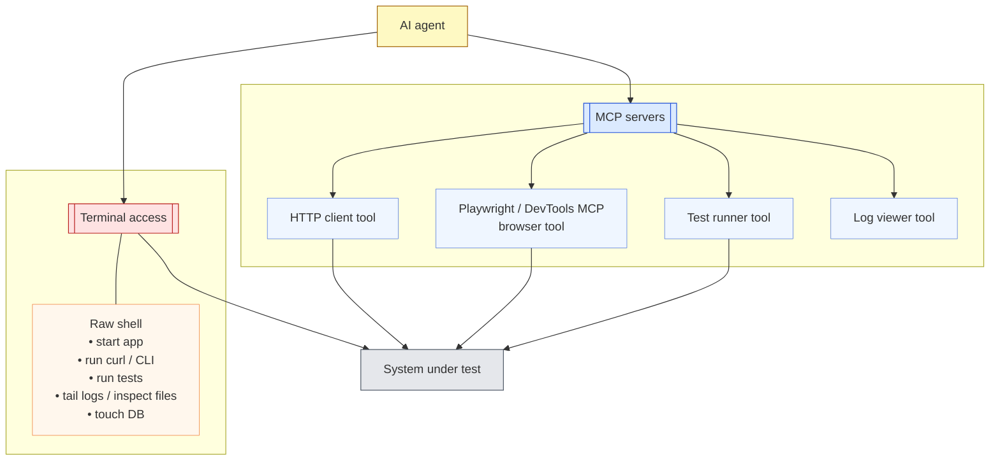

Over the last year or so, [**agentic coding**](https://www.awesome-testing.com/2025/09/playwright-agentic-coding-tips) has gone from novelty to serious contender for “default way of working” in many engineering teams. Tools like Claude Code, Cursor, Copilot or Codex are no longer just autocomplete toys – they’re starting to write whole features, fix bugs, wire up tests and keep up with reviews. Plenty of companies are now asking a very practical question: how do we adopt this safely and at scale, without breaking everything or annoying our engineers?

What’s interesting is that these tools are already doing far more than writing code. Anthropic’s own internal report on how their [teams use Claude Code](https://www-cdn.anthropic.com/58284b19e702b49db9302d5b6f135ad8871e7658.pdf) shows it being used across data infrastructure, security, product, marketing and even legal – debugging Kubernetes clusters from screenshots, navigating huge codebases for new hires, and automating complex data workflows for non-technical colleagues. In other words, these "coding agents" are already behaving like **general-purpose engineering agents** that happen to live in an IDE, CLI or in the cloud.

If we accept that, it becomes natural to ask a follow-up question: if AI coding agents are effectively general-purpose agents, what happens if we point them at testing? Instead of only helping us write tests, could they test the application instead?

That’s what I want to explore in this post. I’ll look at agentic testing – letting agents test the application – from two angles:

- **White-Box Agentic Testing** – where the AI analyses the codebase, architecture and requirements directly, looking for bugs, gaps and risky areas before (or alongside) execution.

- **Black-Box Agentic Testing** – where the AI exercises a running application using the tools we give it: HTTP clients, terminals, MCP servers, browser automation, and so on.

The goal is not to sell a magic replacement for your existing regression suite, but to evaluate where these agents genuinely add value today, and how they might fit alongside the good old test pyramid rather than trying to blow it up.

## Classic Test Pyramid


Most of us still think about testing through the classic pyramid: lots of cheap checks at the bottom, fewer expensive ones at the top. At the base, you have static checks and compilation. This is where AI already helps set up linters, configure sensible rules, and wire them into your editor so they act as a fast feedback loop while you type, rather than as a noisy afterthought in CI.

A step up, at the unit level, AI makes it much easier to work in a [TDD-ish](https://www.awesome-testing.com/2025/10/test-driven-ai-development-tdaid) way. You describe the behaviour you want, and the agent can sketch out test cases, propose edge conditions and turn them into executable tests. It’s surprisingly good at nudging you towards effective tests instead of a pile of trivial “assert true” noise.

Higher up, around the API layer, you can hand the agent your OpenAPI spec or docs and ask it to actually hit the service. It can sit in a terminal and drive `curl` commands, try different payloads, inspect responses and tell you where the behaviour diverges from the documentation.

At the top, on the UI side, the same idea applies but with a browser. Give the agent [Playwright MCP](https://www.awesome-testing.com/2025/07/playwright-mcp) or [Chrome DevTools MCP](https://www.awesome-testing.com/2025/09/chrome-devtools-mcp) as tools and it can open your app, click through flows, fill forms and report what it sees.

In other words, the pyramid stays the same, but AI is already quietly embedded at every level, from linters through TDD to API and UI checks. Agentic testing is just the next step: instead of asking AI to help us write tests, we start letting it run them.

## Coding agents are already testing agents in disguise

Most marketing around Claude Code, Codex, Cursor, Copilot and the other top tools still frames them as coding assistants. They sit in your editor/CLI and suggest snippets, write boilerplate and occasionally generate half a feature. But if you actually use them day to day, you quickly notice something else: they’re weirdly good at general computer work, not just code.


You can ask them to tweak your shell prompt, install and configure a new CLI tool, clean up a nasty docker-compose file, or help debug a broken local setup. They read terminal output, propose a fix, run a command, look at the error, adjust the plan and try again. That’s no longer autocomplete with extra steps – that’s an agent quietly running a reason–act loop over your machine.

Under the hood, they keep doing the same thing: reason about the current state, decide what to do next, call a tool, look at the result, update the plan. Think → act → observe → repeat. Because they’re good at that pattern – at planning, making decisions and following through – they end up being useful far beyond writing `for` loops and React components.

This is where the usual “let’s build a new agent for every use case” story starts to look a bit unnecessary. A lot of books and tutorials push you towards creating a fresh agent for each problem: a research agent, a shell agent, a Jira agent, a testing agent, each with its own loop and tooling. But if you look at what we already have in Claude Code, Cursor, Copilot and friends, the picture is different. These agents are already wired into your editor, your terminal, sometimes even your browser. They already know how to read code, run commands, call APIs and keep context across multiple steps.

So the real question is: do we actually need a separate “testing agent”? Or can we just reuse the coding agents we have and point them at our testing problems? In practice, you can say to the agent: here is the codebase, here are the APIs and the docs, here are the tools you’re allowed to use – curl, Playwright MCP, Chrome DevTools MCP, test runners – and here is what I want you to check. From that point on, the difference between a coding agent and a testing agent is mostly in how we prompt it and what outcome we care about.

The heavy lifting is already there: reasoning, planning, calling tools, handling errors. That’s the core idea behind agentic testing in this post. Instead of obsessing over building bespoke “QA agents”, we can start by squeezing more value out of the powerful agents already sitting in our IDEs and terminals, and see how far they can take us into testing.

## So what is agentic testing, exactly?

This naturally brings us to the question: what do I actually mean by agentic testing?

In this post I’ll use a very simple definition: agentic testing is testing done by AI agents. Not scripts, not humans clicking around, but the same kind of agents we just talked about – the ones you can install in your IDE or editor with almost one click today.

Once you look at it this way, the interesting bit is how to slice the space. A useful, high-level split is into two flavours.

The first is a white-box approach. Here we let the agent peek inside the code and reason about it directly. You can ask it to walk through error paths, think about edge cases, spot risky patterns, suggest missing tests or even point out potential bugs just from reading the implementation and the surrounding context. It’s essentially giving the agent read access to the internals and saying: “tell me what could go wrong here”.

The second is a black-box approach. In this mode we treat the system as a running application and let the agent exercise it using the tools we provide: terminal commands like curl, HTTP clients, browser automation via MCP servers, Playwright, Chrome DevTools MCP and so on. The agent doesn’t need to see the code – it interacts with the system like an external tester would, sends requests, clicks through flows, observes responses and reports what it finds.

Both are agentic testing. One thinks over the code, the other plays with the live system. In the rest of the post I’ll keep coming back to this distinction, because it shapes both what’s possible today and where the sharp edges are.

## White-box agentic testing

White-box agentic testing is the part where we let the agent actually look inside the code. This is where today’s coding agents are already very strong, and where you can get value almost immediately without building any custom framework. You give the agent your repository, your build system and a rough goal, and let it reason about the codebase directly.

### 1. Let the agent wire in analysis and coverage

The first, almost boring, use case is simply getting all the static analysis and coverage machinery in place. Coding agents are excellent at this.

You can ask the agent to introduce and configure whatever makes sense for your stack: linters, type checkers, PMD, SpotBugs, ESLint, style checkers, you name it. You can then ask it to plug in a coverage tool such as JaCoCo, hook it into your build, make sure reports are generated, and, if you want to be fancy, surface those numbers in CI or in a dashboard.

The important bit is that this work has a very clear goal and a very clear feedback loop. If coverage is at 42%, the agent knows it hasn’t finished yet. If the linter fails, the agent can see the error and fix the config. This kind of “plumbing” used to be a half-day of documentation reading and trial and error; now you can offload most of it to an AI that doesn’t get bored.

### 2. Let it critique and evolve your unit tests

Once the tools are in place, you can ask the agent to turn its attention to the tests themselves.

Here the agent can read your unit tests and production code side by side and give you an opinion. It can highlight branches that are never exercised, boundary conditions that are missing, and areas where you are obsessively testing trivial getters while ignoring real logic. You can push it further and ask for suggestions on how to improve specific tests, or how to restructure code to make certain behaviours easier to test.

In the past we tried to answer the question “are my tests any good?” with mutation testing: randomly tweak the code, see which mutants survive, treat surviving mutants as a sign of weak tests. Now you can ask the agent to do a more targeted version of that in its head. It can propose realistic mutations that are likely to reflect real bugs, reason about whether your current tests would catch them, and then either strengthen existing tests or generate new ones. Generating unit tests, improving them and assessing their quality becomes a single conversation instead of three different tools.

### 3. Let it simulate test execution

The third use case is the one that feels odd at first: asking the agent to simulate running tests without actually executing anything.

You can take real test cases or test ideas and ask the agent to mentally step through them against the code. Given this setup and these inputs, which paths are taken, what values do variables have at each step, where are the surprising branches, what could go wrong if some precondition is violated? For a human, doing this across a non-trivial codebase is exhausting. For an LLM, it’s just more tokens.

This means you can ask questions like “if I change this function, which tests would realistically start failing?”, “what hidden coupling exists between these two parts of the code?”, or “what edge cases are missing from this test class?”. The agent can explore multiple paths, track different outcomes and report back scenarios you might not have considered.

Adding static analysis and coverage, generating and improving unit tests – those are essentially accelerators for techniques we already know. Letting an AI simulate execution and reason about how tests would behave before you run them is genuinely new. And the nice part is that you don’t need a special research model to try it; the coding agents already sitting in your IDE are usually enough to start experimenting.

### Example 1 - Java Spring Boot application

I ran a white-box agentic testing session on my `test-secure-backend` [project](https://github.com/slawekradzyminski/test-secure-backend), giving Codex a single prompt: analyse test coverage and find gaps.

> Analyse the test coverage and attempt to find the gaps in my unit tests. What kind of tests do you suggest to write? Is the system sufficiently tested on unit tests level? Are there any gaps we should tackle?

The agent scanned the Maven build and source trees, concluding that most coverage came from `@SpringBootTest` integration tests with almost no focused unit tests for services, security components or repositories. It also noticed no coverage tooling was configured.

From there it created an `IMPROVEMENT_PLAN.md`, wired in [JaCoCo](https://github.com/slawekradzyminski/test-secure-backend/actions/runs/19781545779) (fixing Java 25 compatibility along the way), updated the `.github/workflows/ci.yml` to archive coverage reports, and started closing gaps. It wrote unit tests for all core services, security classes (`JwtTokenProvider`, `JwtTokenFilter`, `WebSecurityConfig`), exception handlers, and repositories with `@DataJpaTest`. Each time it adjusted fixtures to satisfy real code constraints and re-ran `./mvnw verify`.

By the end: JaCoCo integrated into CI, ~94% line coverage, and much better protection around business rules and security – all driven by the agent reading code, reasoning about risks, and implementing tests to match.

### Example 2 - React frontend application

> Looking at the code do you see any bugs in frontend codebase? Analyse it using your expertise


## Black-box agentic testing: what makes it possible

Before we talk about how an agent can test a running system, it’s worth looking at what actually makes that possible in the first place. In practice, most agents today have two main ways of touching your application: the terminal, and MCP servers.



The terminal is the blunt instrument. If your agent can run shell commands, it can in theory do almost anything you can: start the app, run curl against your APIs, execute your test suites, tail logs, inspect files, hit databases, the lot. That’s exactly why many companies are understandably nervous about enabling it. An agent that can execute arbitrary commands is powerful, but it’s also a risk if you don’t trust the model, the prompts or the surrounding controls. When you do turn terminal access on in a controlled environment, though, black-box agentic testing suddenly becomes very straightforward. The agent can build or start the system under test, exercise it via HTTP or CLI, and observe real behaviour end to end.

The second path is through MCP servers. MCP was designed precisely to give models a structured, explicit way to call tools. Instead of saying “here’s a shell, good luck”, you say “here are a few well-defined tools you’re allowed to use, described by a protocol”. Those tools might include a HTTP client, a Playwright-driven browser, a test runner, a log viewer, or anything else you expose as an MCP server. The coding agent doesn’t need to know how they’re implemented; it just calls named operations with parameters and gets structured results back.

This means we can extend a coding agent with very specific testing powers without giving it raw access to a whole machine. Through MCP we can bolt on a “call this API endpoint” tool, or a “click this selector in the browser” tool, or a “run this test suite and return the summary” tool. From the agent’s perspective, both the terminal and MCP look like ways to act in the world. The difference is that MCP lets us shape and constrain those actions very precisely, which is exactly what we want when we move into black-box testing of real systems.

### API testing via terminal

Once an agent has access to a terminal, API testing becomes almost embarrassingly simple. Give it the docs or an OpenAPI spec, and it can start firing curl requests at your service, tweak headers and payloads, follow redirects, replay tricky flows, and generally treat your backend the way a slightly obsessive QA engineer would.

The problem, of course, is security. In most companies, “let the model run arbitrary shell commands on a developer laptop or CI worker” is a hard no, and that’s perfectly reasonable. One way to make this safer is to hide curl behind a custom MCP server that exposes a safer HTTP client: instead of raw shell, the agent gets a “call this endpoint” tool with clear limits. You can even require explicit human approval for each generated command before it’s actually executed.

The downside is obvious: the more you wrap and approve things, the less like a fluid exploratory session it feels. If every curl needs a pop-up confirmation, your “agentic test run” quickly turns into a slow, manual review of suggested commands.

The cleaner approach is to give the agent real freedom, but only inside a deliberately isolated environment. Spin up a sandboxed VM or container that has your service and its dependencies, plus a terminal the agent can drive. Inside that sandbox, it can do whatever it wants: run curl, install helper tools, restart the app, hammer endpoints with weird payloads. Outside that sandbox, it can’t touch anything. In that setup, terminal-driven API testing becomes both effective and safe enough to be interesting in practice.

### API testing via terminal - Example

To make this less abstract, let me walk through a concrete example of terminal-driven agentic testing I ran recently.

The setup was simple. I had a local API running on `http://localhost:4001` and a Cursor coding agent with access to a terminal inside an isolated dev environment. I handed the agent two things: the OpenAPI docs (`api-docs.json`) and an exploratory testing plan that started with `/users/signup` and `/users/signin`. The only “tool” it needed was curl.

> In @api-implementation-plan.md I have plan to cover API tests with Playwright automated tests.
>
> Now I wish to conduct agentic-led exploratory tests. Create a similar plan which starts with /users/signin and /users/signup endpoints. Tell in the plan that the agent can use documentation available in @api-docs.json and curl terminal command, example:
>
> ```
> curl -X 'POST' \
  'http://localhost:4001/users/signin' \
  -H 'accept: */*' \
  -H 'Content-Type: application/json' \
  -d '{
  "username": "admin",
  "password": "admin"
}'
> ```

> Now conduct mentioned tests for signup/signin. Document everything you perceive suspicious or weird

The methodology was deliberately close to how a human would do exploratory API testing. The agent started with the happy path for registration and sign-in, then moved into variations: missing fields, too-short usernames, invalid emails, malformed JSON, duplicate usernames and emails, different combinations of roles, and so on. Every step was executed as a concrete curl command, with the agent reading the response, comparing it to the docs, and deciding what to try next. Because it was running in a sandboxed environment, I didn’t have to worry about it doing anything dangerous to my machine – it could freely hit the API, replay requests and tweak payloads.

The findings were very close to what you’d expect from a diligent human tester, but produced much faster. The agent confirmed that the basic flows worked and that most validation rules were enforced, but it also surfaced several issues that are easy to miss when you’re tired: inconsistent status codes for validation vs authentication errors, 401s where a 400 would make more sense, noisy error messages leaking internal Java class names and package structure, and a particularly nasty problem where the signup endpoint happily allowed anyone to register themselves as an admin user by sending ROLE_ADMIN in the roles array.


What’s interesting here is not that these bugs existed – in test-purposes applications they always exist – but that an off-the-shelf coding agent, given a spec, a URL and curl in a safe environment, was able to behave like a competent exploratory tester. It built up a mental model of the authentication API, probed the edges, and produced a readable report with concrete requests and responses. That’s the flavour of black-box agentic testing I find most promising: lightweight, sandboxed, driven by the same reasoning loop the agent already uses for coding, but pointed at “try to break my API” instead of “help me implement it”.

Check the full exploratory testing report [here](https://github.com/slawekradzyminski/playwright-2025/blob/0c89d660e7a7dce05845ab7c2635ca3df246d2d2/exploratory-test-findings-signup-signin.md).

## UI testing via Playwright MCP and Chrome DevTools MCP

On the UI side, the big unlock was the arrival of things like Playwright MCP and Chrome DevTools MCP. Until then, even if your agent could in theory “use a browser”, in practice it meant a messy mix of custom scripts, half-documented APIs and a lot of glue code. With MCP-based browser tooling, you suddenly get a clean, explicit way for the agent to see and drive the UI.

Instead of hand-rolling your own bridge, you give the coding agent a browser tool that can open pages, click elements, fill fields, wait for selectors, take screenshots and read bits of the DOM. From the agent’s perspective it becomes just another set of actions it can call: “navigate to this URL”, “click this button”, “type this text”, “assert that this element is visible”. Under the hood, Playwright MCP or Chrome DevTools MCP handle the real browser automation.

This is a major enabler for agentic UI testing. It means you can say to the agent: here is the app, here is a test mission, here are the browser tools you’re allowed to use. The agent can then walk through flows, try alternative paths, capture screenshots when something looks wrong and report back what happened, all without you writing a line of Selenium-style code.

And, crucially, it does this without giving the model raw remote control over your entire desktop. The MCP layer defines exactly what “using the browser” means: which actions are possible, what data comes back, where the boundaries are. That makes it realistic to let an agent interact with a real UI in a controlled way, which is exactly what we need to make black-box agentic testing possible.

## UI testing via Playwright MCP and Chrome DevTools MCP - Example 

In my case, I pointed Playwright MCP at two simple pages: `/register` and `/login` on `http://localhost:8081`, with the same backend API that the agent had already explored via curl. The agent could open the pages, fill in forms, submit them, watch the network traffic and take screenshots, all by calling high-level browser actions through MCP rather than any custom Selenium code. The test “mission” was the same as at the API level: try the happy paths, then start leaning on validation and edge cases to see where the UI and backend behaviour diverge. 

> Now using playwright MCP perform similar exploratory tests for http://localhost:8081/register and http://localhost:8081/login pages (which utilises the api tested already)

Methodologically it looked very close to how a human would do it. The agent started by submitting empty forms and obviously invalid data, checking that inline validation messages appeared and that the frontend’s rules matched what the API enforced for username length, email format and password strength. It then moved on to real registrations and logins, watching how the UI reacted: success toasts, redirects from `/register` to `/login`, navigation changes after login, logout behaviour and what happened when it tried to log in with bad credentials or a non-existent user.


What came back was a nice mix of “good, this works” and “hm, this is a bit off”. On the positive side, most client-side validation was solid, navigation and redirects behaved as expected, and the login flow correctly reflected backend responses. On the negative side, the agent spotted a misleading error message when registering with a duplicate email (the UI claimed the username already existed), a complete lack of loading states during form submissions, and some smaller UX gaps like missing autocomplete attributes and password visibility toggles. It also raised an eyebrow at the invisible role handling in the registration flow, which ties directly into the API-level security concerns around `ROLE_ADMIN`. Overall, the exercise showed that with Playwright MCP and DevTools MCP wired in, a coding agent can perform very human-like exploratory UI testing and surface both UX issues and inconsistencies with the underlying API.

Check the full exploratory testing report [here](https://github.com/slawekradzyminski/playwright-2025/blob/0c89d660e7a7dce05845ab7c2635ca3df246d2d2/exploratory-test-findings-ui-register-login.md).

## Agentic testing: benefits and sharp edges

By this point it should be clear that **agentic testing is already possible**. Both the white-box (“read the code and think”) and black-box (“exercise the system via tools”) flavours have very real upsides – and equally real pain points. Let's analyse them one by one.

### Where agents really shine

The most obvious win is **how quickly agents can create and evolve tests**. On the white-box side, AI coding agents can read your code and spit out hundreds or thousands of unit tests in minutes, not days. That’s not just more tests, it’s often better tests: the model has seen millions of code patterns and tends to propose edge cases humans forget – awkward nulls, extreme numbers, odd combinations of flags.

At the black-box level, agents can **learn unfamiliar APIs and UIs on the fly**. Give them a spec or some docs and they’ll do what a patient junior engineer does: try a request, read the error, tweak the payload, follow links in the documentation, and repeat until something works or clearly doesn’t. In [one study](https://arxiv.org/abs/2402.05102), an LLM agent exploring public REST APIs managed to discover genuine 500-level server errors simply by mutating inputs and watching for crashes, which is exactly what we want from exploratory testing rather than just scripted happy paths.

A third benefit is **high-level reasoning across artefacts**. Because the same agent can see requirements, code, logs and responses, it can spot mismatches humans often miss. A requirement says “the system supports scenario X”, the agent looks at the code and tests and points out that scenario X doesn’t exist anywhere. Or it notices that an error message in the docs doesn’t match what the API actually returns, which is both a bug and a documentation problem. This “cognitive static analysis” is hard to replicate with traditional tools.

Finally, there’s a potential **maintenance win**. If an AI can keep generating and updating tests whenever the code changes, you reduce the test maintenance tax. Instead of humans hand-editing brittle test suites every time a signature changes, you ask the agent to refresh the tests for the affected module and review what it proposes. It’s not magic, but it shifts a lot of grunt work from people to the tool.

### Where things get painful

The flip side is that **agentic tests are expensive and slow compared to traditional automation**. Every thought, every tool call, every retry is tokens and latency. In the [REST-driven experiments](https://arxiv.org/abs/2402.05102) mentioned in the research, a single LLM-guided exploration of one API could take several minutes and hundreds of requests. That’s fine as an occasional deep dive or a nightly job, but it’s not something you casually drop into your “run on every commit” pipeline. You can mitigate a bit with smaller or local models, but then you trade cost for quality.

The second big issue is **environment control and stubbing**. In normal automated tests we are obsessed with mocking: we stub payment gateways, email services, third-party APIs, anything that can be slow, flaky or dangerous. An autonomous agent doesn’t automatically understand which calls are “safe” and which ones charge real credit cards. The research suggests proxies, sandboxes and specialised tools (e.g. an MCP server that simulates an external service) as ways to keep the agent in a safe box, but this adds design work. You have to decide what realism vs repeatability trade-off you’re willing to make.

Then there’s the **oracle problem**. Agents are good at spotting obvious failures – 500 errors, exceptions, screens that clearly didn’t load. They’re much weaker at knowing when something is semantically wrong. If a function returns 4 where the business rule says it should return 5, the agent won’t know unless you tell it what “correct” means. Without explicit acceptance criteria embedded in the prompt or in tools, you end up with a tester that reports what happened but can’t always tell you whether it’s acceptable.

On top of that, **agentic runs are often non-deterministic**. The same goal can be achieved with different sequences of actions, or occasionally not achieved at all because the model took a slightly different path. Traditional tests are valued precisely because they behave the same way every time. Here, you may get a “pass” one day and a “spurious fail” the next for reasons that are hard to replay. You can clamp down temperature and narrow the toolset, but some variation is intrinsic to this style of testing.

Even when the agent does a good job, **reporting and traceability are not free**. A coded test gives you a neat green or red bar, a stack trace and maybe a screenshot. An agent gives you a long conversation, dozens of tool calls and a blob of prose at the end. Turning that into something your team can consume – structured steps, clear evidence, links to logs and screenshots – usually means building a harness around the agent and post-processing its run into a proper report. Otherwise, you’re stuck scrolling through transcripts.

Finally, there is the soft but non-trivial problem of **trust and culture**. Teams are already cautious about AI-generated code. AI-generated tests, or AI-executed tests, are an even harder sell. If a suite of agentic tests is green, does anyone feel confident enough to ship on that basis alone? Probably not today. The research and early tools mostly position AI as an augmenter: great at writing tests, great at finding extra bugs, but still needing human oversight and judgement. That’s aligned with how I’d treat it: as a powerful co-tester rather than an oracle.

## Wrapping up

Agentic testing really does feel like a new species in the testing ecosystem. When I started digging into it, I was surprised how little there is out there: almost no books, very few serious blog posts, a handful of research papers and product docs that just brush against the idea. Most of the work you can find is either focused on AI-generated unit tests or on LLMs poking at public APIs, and even there the tone is cautious but generally positive. The specific idea of “let’s treat coding agents as first-class testers” is basically not documented at all.

At the same time, you can’t ignore the elephant in the room: cost. For a large page with a complex accessibility tree and bloated DOM, or for a non-trivial API surface with thousands of lines of docs and examples, you’re going to burn a lot of tokens just to give the agent enough context to work with. Each extra step, each retry, each screenshot or log chunk is more context. That adds up very quickly on hosted models. The obvious escape hatch is “just run a local LLM on your own infrastructure”, but that comes with its own price tag in hardware, maintenance and usually quality. Right now, for most teams, that trade-off doesn’t magically solve the cost problem, it just moves it around.

So at this moment I see agentic testing less as a new, systematic way to run your whole regression, and more as a very capable personal assistant for testers. Something you can call in to explore a new feature, stress a tricky endpoint, or sanity-check your coverage. In that role, it’s absolutely worth considering. It’s already helped me find not one, not two, but multiple real bugs in my own application, in places I probably wouldn’t have wandered into manually on a busy day. It is a real deal – but a real deal that is capricious, occasionally flaky, and definitely not cheap.

For mature products with real customers and real SLAs, I would still bet on good old automation code as the backbone of regression. The twist is that writing that code is now much easier: AI agents can generate the bulk of your tests, help wire up the tooling, and keep the suite healthy. If generating test code isn’t a big deal anymore, there’s no reason not to lean on that while agentic testing grows up in the background.

So my recommendation is simple: treat agentic testing as an experimental superpower on the side. Use it on new products, during early exploration, on domains where you can tolerate the cost and occasional weirdness. Watch where it genuinely helps and where it wastes time. And keep an eye on how the models, protocols and tools evolve. The underlying capabilities are already impressive; the question now is how quickly they’ll become cheap and predictable enough to sit alongside your existing test pyramid as a first-class citizen. Interesting times ahead, indeed.

## AI posts archive

  - [The rise of AI-Driven Development](https://www.awesome-testing.com/2024/09/the-rise-of-ai-driven-development)
  - [From Live Suggestions to Agents: Exploring AI-Powered IDEs](https://www.awesome-testing.com/2024/12/from-live-suggestions-to-agents-exploring-ai-powered-ides)
  - [AI Vibe Coding Notes from the Basement](https://www.awesome-testing.com/2025/04/ai-vibe-coding-notes-from-the-basement)
  - [How I use AI](https://www.awesome-testing.com/2025/06/how-i-use-ai)
  - [How does Playwright MCP work?](https://www.awesome-testing.com/2025/07/playwright-mcp)
  - [AI Tooling for Developers Landscape](https://www.awesome-testing.com/2025/07/ai-tooling-for-developers-landscape)
  - [Playwright Agentic Coding Tips](https://www.awesome-testing.com/2025/09/playwright-agentic-coding-tips)
  - [Mermaid Diagrams - When AI Meets Documentation](https://www.awesome-testing.com/2025/09/mermaid-diagrams)
  - [AI + Chrome DevTools MCP: Trace, Analyse, Fix Performance](https://www.awesome-testing.com/2025/09/chrome-dev-tools-mcp)
  - [Test Driven AI Development (TDAID)](https://www.awesome-testing.com/2025/10/test-driven-ai-development-tdaid)
  - [Testing LLM-based Systems](https://www.awesome-testing.com/2025/11/testing-llm-based-systems)
  - [Building RAG with Gemini File Search](https://www.awesome-testing.com/2025/11/gemini-file-search-managed-rag)
  - [Playwright MCP Security](https://www.awesome-testing.com/2025/11/playwright-mcp-security)
