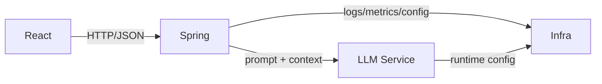

We built IDEs to get away from the terminal. They gave us autocomplete, refactors, visual debugging, and a sense that “modern development” means clicking around in a rich interface instead of typing commands like it’s 1999. That’s why the current wave of AI-powered CLI tools feels a bit paradoxical: after decades of tooling designed to pull us out of the command line, we’re voluntarily going back in.

My claim is simple: this isn’t nostalgia, and it isn’t about preferring terminals over web UIs. The reason AI CLI tools are exploding is that they push the most important part of engineering to the front — **high-level thinking**.

Working in the terminal feels a bit like being a general on a hill (Napoleon if you like the mental image): you’re not micromanaging every soldier’s boots and buttons. You’re surveying the terrain, choosing a strategy, and issuing orders to semi-autonomous units. In our world, those units are repositories and services. A CLI agent naturally operates at the business level, workflow level, and architectural level: what we’re trying to achieve, what needs to change, in what order, and how we’ll verify it.

## The new CLI

Before AI entered the picture, the command line already had a few timeless advantages. It’s quiet. It’s keyboard-first. It’s composable in a way GUIs rarely are: you can glue small tools together, pipe outputs, script repeatable workflows, and automate multi-step chores without opening three different windows and babysitting them. That combination of focus + composability is exactly why people keep drifting back to terminals whenever work becomes complex or repetitive.

But the current CLI renaissance isn’t driven by `grep | awk | sed` nostalgia. The new ingredient is the terminal agent. Once you give an AI assistant a CLI, it can effectively do anything you could do by typing commands: run linters, execute test suites, start services, inspect logs, apply repo-wide refactors, and orchestrate changes across multiple repositories. At that point the terminal stops being “a place where I run commands” and becomes a control plane for engineering work — a conversational layer on top of the machine where ideas can be turned into action quickly, with the existing CLI ecosystem acting as the execution backend.

This is also why the trend is exploding now. Models have reached the point where they can meaningfully navigate and edit real codebases, and “agent tooling” has matured: shell access, git awareness, structured plans, and the ability to run the same validation commands we already trust (tests, linters, CI). At the same time, our systems have become more distributed. Even “simple” product work often spans backend, frontend, infrastructure, and shared libraries. The CLI agent meets that reality head-on.

In [Simon Willison's words](https://news.ycombinator.com/item?id=45416228#:~:text=Something%20I%20realized%20about%20this,interesting%20form%20of%20general%20agent):

> Something I realized about this category of tool (...) is that they're actually an interesting form of general agent.
>
> Claude Code, Codex CLI etc can effectively do anything that a human could do by typing commands into a computer.
>
> They're incredibly dangerous to use if you don't know how to isolate them in a safe container but wow the stuff you can do with them is fascinating.

I've described how this philosophy can be applied to Software Testing in [Agentic Testing post](https://www.awesome-testing.com/2025/11/agentic-testing).

## CLI agents force architectural thinking

Here’s the real reason I think AI CLI tools are taking off: they pull you up a level. They make you treat software as a system again, not as a collection of files you happen to have open right now. When you work with an agent in the terminal, you naturally start by deciding what you want, why you want it, and how you’ll know it worked — and only then do you descend into the implementation details.

### Bird’s-eye view by default

A CLI session tends to frame the world in terms of directories, repositories, commands, and outcomes. That sounds mundane, but it changes your behaviour. Instead of thinking “how do I implement this class?”, you think “what sequence of changes will deliver the business outcome safely?”. You become the general again: you set intent, the order of operations, constraints (security, performance, backwards compatibility), and validation criteria — then you delegate execution to the agent.

That’s also why CLI agents are so good at planning. They don’t tempt you with immediate code edits and local refactors. They nudge you towards the uncomfortable but essential part of engineering: designing the approach before touching the implementation.

### Multi-repo is the modern default

Most real systems aren’t a single repo any more. They’re a constellation: backend services, frontends, infrastructure code, shared libraries, deployment manifests, observability config, maybe a few “glue” services you wish didn’t exist but do. Microservices aren’t the only reason for this, but they make it obvious: a “simple feature” often spans multiple repos by definition.

This is where terminal agents feel oddly… natural. Asking an agent to move between repositories, inspect contracts, coordinate changes, and keep a running plan is closer to how modern systems actually work. IDEs can support multi-repo work, but they usually encourage a mental model where one repo is “the main one” and everything else is peripheral. CLI work flips that: the unit of work is the feature across the system, not the repo you opened first.

#### A concrete example: my “local LLM + microservices” playground

To make this less abstract, here’s a setup I’ve been playing with recently (and it’s representative of what modern “simple” work often looks like). I’m wiring local LLMs into an application that has a fairly standard split:

- Backend: Spring / Java
- Frontend: TypeScript / React
- LLM layer: a mock LLM service (for predictable tests) and/or a local model wrapper
- Infra: Docker files, Compose (or similar orchestration), plus the usual shared configuration bits

Even in a small personal playground, I’m already spanning multiple repositories and multiple types of concerns: API design, UI integration, service contracts, containerisation, and test strategy. In a real organisation you can multiply this by “shared libraries”, “platform repos”, “deployment manifests”, “observability”, “feature flags”, and suddenly the system is the only sensible unit of work.

Here’s the mental picture I keep in my head when I say “multi-repo system”:



This is exactly the kind of environment where CLI agents feel at home. You can discuss the feature at a high level (“what’s the interaction contract?”, “how do we mock it?”, “how do we validate it end-to-end?”), then tell the agent to drop into each repository in turn and execute the plan — without losing sight of the bigger system the whole time.

## CLI agents as a rubber duck (that talks back)

There’s a subtle benefit to working with a CLI agent that has nothing to do with “code generation”. The terminal interaction forces you to state the problem clearly. When you dictate a feature idea as a stream of thought — what you want, why you want it, constraints, edge cases — you often catch gaps before the model even replies. Half the value comes from turning vague intuition into explicit language.

Then the agent becomes a verifier. Not in a mystical “it knows the truth” sense, but in a very practical way: it can challenge your plan, ask the awkward questions you forgot to ask, and surface risks early.

You can paste prompts like these into a session:
```
Is this plan coherent end-to-end? Where are the weak links?
What assumptions am I making that could be wrong?
What’s the riskiest part of this design and how do we de-risk it?
What should we test first to validate the architecture?
```

This is where I think senior engineers often leave value on the table. We’re used to being the ones who review other people’s plans — but we don’t always run our own thinking through a tight feedback loop. A CLI agent is an always-on reviewer/architect that can keep you honest, propose alternatives, and sanity-check your reasoning across backend, frontend, and infra without you having to context-switch between tools or teams.

## An executable workflow: feature orchestration with a CLI agent

If you treat a CLI agent as “autocomplete for the whole system”, you’ll get noise: half-plausible code, missing constraints, and a false sense of progress. If you treat it as an orchestration assistant, you get something far more valuable: a repeatable way of turning a business goal into cross-repo delivery, with verification baked in.

This workflow is tool-agnostic. I’ve used it with tools like Codex CLI and Claude Code, but the important part is the rhythm, not the brand name.

### Step 1: Pre-work, context dump, rubber-ducking

Start before you touch any repo. This is the part where you pour the messy human thinking into the session: intention, context, constraints, and what “done” actually means. I genuinely prefer speaking at this stage, because speaking makes me include the awkward details I’d otherwise skip in writing — and those awkward details are usually where the real risks live.

The goal is to leave the agent with a clear brief: what we’re building, why we’re building it, what we must not break, and how we’ll prove it works.
Example prompt you can paste:

```
I’m about to implement [feature] across multiple repos.
First, help me write a one-page brief. Ask me the questions you need to clarify requirements, edge cases, security constraints, non-goals, success criteria, rollout/rollback, and how we’ll validate this in a production-like environment.
Do not propose code yet — stay at the level of intent and verification. I want to build a common understanding on what we will build together.
```

If you want to force business-first thinking:

```
Challenge my framing. Restate the problem in business terms, list hidden assumptions, then propose success criteria that are measurable.
```

This phase is not a formality. It’s where most bugs die before they’re born.

### Step 2: High-level implementation plan (system view first)

Once the brief is clear, keep the agent at the workspace root (the parent directory that contains all repos). That small choice changes the agent’s posture: it stops thinking like a coder inside a single project and starts thinking like an engineer shipping a change across a system. The deliverable you want at this stage isn’t code. It’s a phased plan that answers three things: what changes, where, and in what order — plus the proof you’ll collect after each phase to confirm you’re still on track.

Some tools offer a dedicated planning mode. You can use it, but I usually don’t bother — I prefer to keep the continuity from the discovery discussion rather than resetting context just to “plan”.

Example prompt:
```
We have these repos: backend/, frontend/, infra/, llm-mock/ (and any shared libs you notice).
Propose an architecture and a phased implementation plan for [feature].
Include an API contract (with example requests/responses), data/model changes, migration strategy, test strategy (unit/integration/e2e), rollout and rollback, plus the exact validation commands we should run after each phase.
Output this as a numbered plan. Don’t modify code yet.
```

If you want the agent to act like a disciplined teammate (and avoid it sprinting into implementation):

```
Write the plan, then stop and wait for approval. If anything is ambiguous, ask questions instead of guessing.
```

A good plan becomes your north star — not something you follow blindly, but something you (and AI agent) keep useful. You’ll update it as you discover constraints, edge cases, or repo-specific realities. The point isn’t perfection. The point is having a shared map that keeps the work coherent as you move between repositories.

### Step 3 - Per-repository implementation, while keeping the plan alive

Now you descend. One repository at a time, but without losing the system narrative. The trick is to treat implementation as execution of the plan, not a freestyle coding session.

Start with the repo that defines contracts and behaviour (often the backend), then move outward. After each repo, update the high-level plan: what’s done, what changed, what was discovered, what must be adjusted.

If you believe that high-level phase definition is too big and require split into smaller increments start with per-repository plan:

```
In @implementation-plan.md I have high-level implementation plan for new feature. Now do a deep dive into backend code and prepare a detailed implementation plan for phase 1. Split it into smaller increments. Each increment should be testable.
```

Example prompt to kick off a implementation phase:
```
Implement Phase 1 from the agreed plan.
Rules: keep changes minimal and reviewable; write/adjust tests; don’t touch other repos yet; and finish by listing the validation commands and expected outcomes.
If you need to change the plan, explain why and update the plan explicitly.
```

Then, and this is important: once the agent has produced working code, move into the IDE. Treat the agent’s output as a draft. Useful, often surprisingly competent — but still a draft.

This is where you do senior work: review diffs, refactor, improve naming, remove duplication, strengthen tests, add missing abstractions, and make sure the codebase won’t hate you in two months. Only then do you return to the CLI and continue with the next repo.

Example “handoff to IDE” prompt (to keep the session clean):
```
Pause implementation. Summarise the backend changes as if you were writing a PR description: what changed, why, how to test, and what to look for in review. Also list any TODOs or risks you’re not confident about.

Prepare a handoff prompt for another AI agent operating under limited backend-only context which I can just copy-paste and kick-off another agentic coding session.
```


When you move to the next repo (say frontend):
```
Switch to frontend/. Implement Phase 2 based on the backend contract we just created.
Keep the UI changes aligned with the success criteria. Add tests where appropriate.
End with validation commands, and update the overall plan/status.
```

By the time you’ve done two repos like this, you’ll feel the CLI advantage: you’re not “opening projects”, you’re executing a system-level operation with continuity.

### Step 4 - verification, release plan, and the final uncomfortable questions

When implementation is complete, go back up to the hill. The last phase shouldn’t be “ship it”. It should be a structured review of what you built: functional correctness, non-functional risks, observability, failure modes, and release readiness.

Example prompt:

```
We’ve implemented the feature across repos.
Now act as a reviewer and expert engineer:
- restate what we built and the final architecture,
- list the top functional risks and how we mitigated them,
- list the top non-functional risks (security, performance, reliability, privacy, maintainability),
- propose a verification checklist (contract/e2e/smoke/observability),
- propose a rollout plan with rollback triggers,
- suggest what to monitor after release.
```

If you want a brutally practical “are we actually done?” test:

```
What evidence would prove we’re done?
Don’t describe effort. Describe proofs: commands to run, signals to check, and what success looks like.
```

This is the moment where the CLI agent feels less like a code generator and more like a force multiplier for engineering judgement. It keeps you honest, it keeps the plan coherent across repos, and it makes verification explicit — which is exactly what you want when systems get bigger than any one IDE window.

## Mitigating the limitations

CLI agents can feel like cheating — right up until they don’t. The trick is to enjoy the leverage without pretending the sharp edges aren’t there. If you name the failure modes early and put a few guardrails in place, you keep the speed and you keep your weekends.

### Context leaks (the slow, quiet failure)

Everything is great while the session is fresh. Then you take a meeting, switch branches, come back tomorrow… and the agent’s mental model starts to drift. It won’t always fail loudly. It might “mostly remember” the endpoint, but forget the one constraint you cared about (“must not leak whether the account exists”). It might implement the right behaviour but for the wrong reason. It’s death by a thousand tiny omissions.

The mitigation is boring and incredibly effective: keep a context pack/documentation (ideally in root folder mentioned above) that you update as you go. Think of it as the project’s short-term memory. It should capture the brief and success criteria, the decisions and trade-offs (with the “why”), the API contract with real examples, the commands you ran (and what you expected to see), and a living list of what’s next. The moment you do that, your work stops being “a chat” and becomes a reproducible engineering process that you (or the agent) can resume without hallucinating the missing pieces.

Aim to always be able to start a new session from scratch.

### Safety (this thing has hands)

A terminal agent isn’t just a clever text box. It can act. It can run commands, modify files, push commits, delete directories, curl endpoints you didn’t mean to hit, and generally move faster than your intuition. That makes it categorically different from a web chat — and it deserves a production-grade mindset.

So treat it like a new teammate who just got access. Put it in a sandbox or container when you can. Keep permissions tight: read-only where possible, scoped credentials where not. Adopt an “ask before execute” habit for anything destructive. And keep secrets out of easy reach (some agents allow to explicitly ignore them) — not because the agent is malicious, but because accidents scale with capability. Give it enough power to help, but not enough power to ruin your day.

### Trust and review (AI is a smart junior, not a judge)

The most dangerous output isn’t broken code. It’s code that compiles, looks plausible, and subtly fails your real requirements. Shallow tests, missing edge cases, wrong abstractions, or a design that will hurt you later — those are the classic “it works on my machine” traps, just delivered at high speed.

The mitigation is to treat AI output exactly like you’d treat a PR from a capable junior engineer. Review it. Refactor it. Strengthen the tests beyond happy-path. Run the whole suite. Run your linters. Run security checks. This is also where the IDE earns its keep: it’s your microscope for making the draft correct, clean, and maintainable.

As I've recommender above: force yourself to explicitly switch your mental context towards repository/code-level thinking by opening an actual IDE and reading each line carefully.

### Multi-tool risk (agents shouldn’t freelance)

Agents are at their best when they’re plugged into a system that can tell them “no”. Linters, formatters, CI, type-checkers, static analysis — these are your rails. Without them, you’re basically trusting vibes, and vibes don’t ship safely.

Make validation explicit at the end of each phase: “run these commands, show me the output, explain what it proves”. Treat CI as the adjudicator, not the model. Define “green tests” as progress. Prefer smaller PRs that you can reason about over huge sweeping changes that are hard to review and harder to rollback. If you believe that certain phase is too big

## CLI vs IDE: don’t pick a religion

This topic tends to trigger a predictable argument: “So… are IDEs dead now?” No. That’s not what’s happening, and it’s not how I work.

An IDE is still the best place for precision. It’s where you zoom in and do careful work: understand code at symbol level, refactor with confidence, trace types, step through a debugger, run focused tests, review diffs properly, and turn a rough implementation into something you’d be happy to maintain. In my workflow, the IDE is where code gets serious.

The CLI agent shines somewhere else. It’s best at orchestration. It helps you stay above the treeline: turn a business goal into a phased plan, move across repositories, keep the context coherent, and execute the boring parts without losing sight of “what are we actually trying to achieve?”. It’s the general on the hill. The IDE is the workshop where you inspect the machinery and tighten the bolts.

### What to do next

If you want to try this without turning it into a productivity philosophy, pick one feature and run the workflow end-to-end. Password reset is ideal: it forces you to coordinate backend flow, frontend UX, email delivery/testing environment, and verification. That’s the real world in miniature — and exactly where CLI agents feel natural.

If you’re coming at this from the testing angle (that’s my bias), this ties directly into how I think about verification in an agentic world. My Agentic Testing post covers the broader idea: agents as participants in testing, not just code generators. And if you want the “sharp edges” perspective — what can go wrong and how to build guardrails — my write-up on Playwright MCP security pairs nicely with the reality that terminal agents are powerful and should be treated with respect.

Tooling will keep changing. The underlying shift won’t. We’re moving from “coding as typing” towards coding as orchestration + verification — and the terminal is simply where that way of working feels most natural.